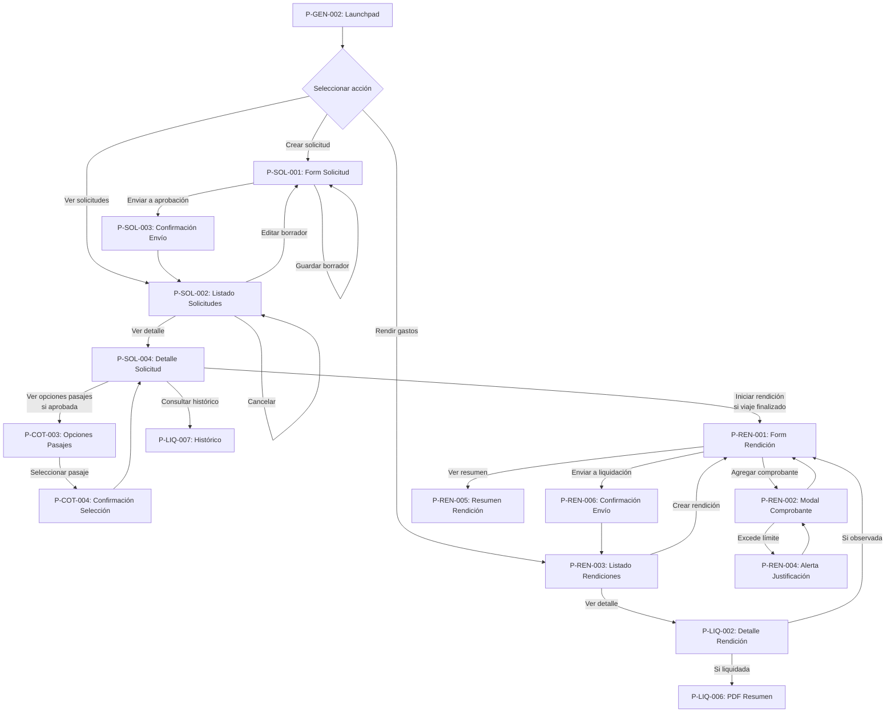
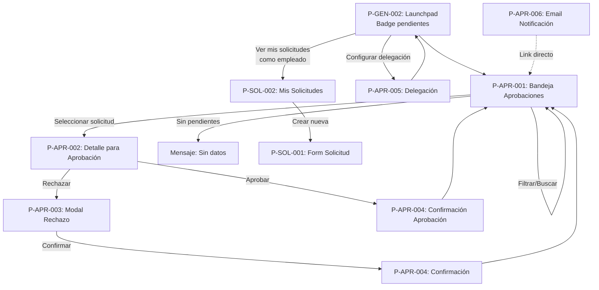
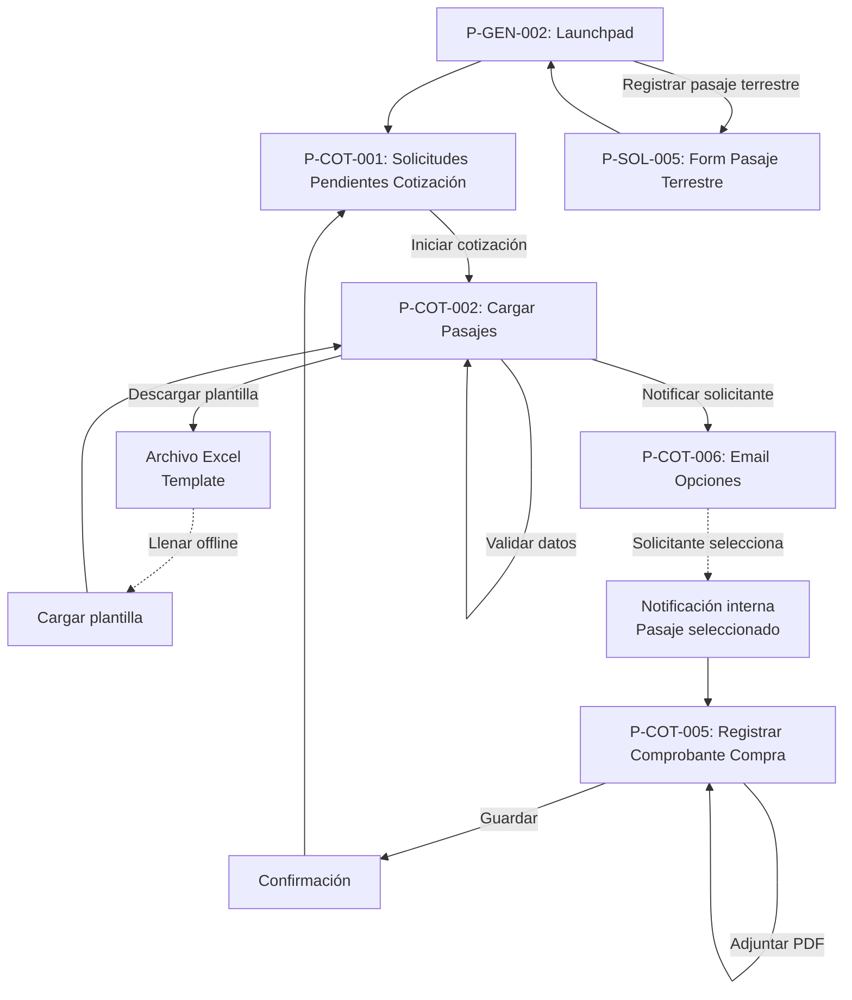
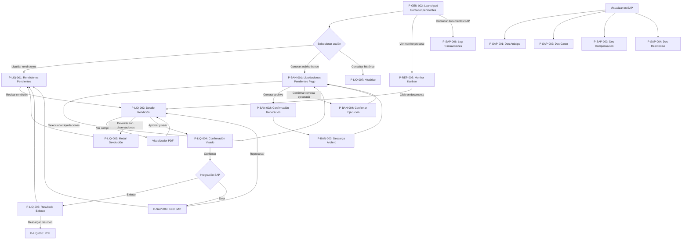
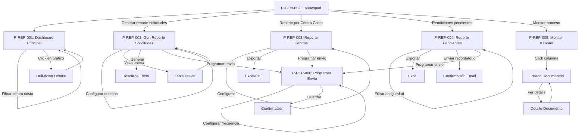
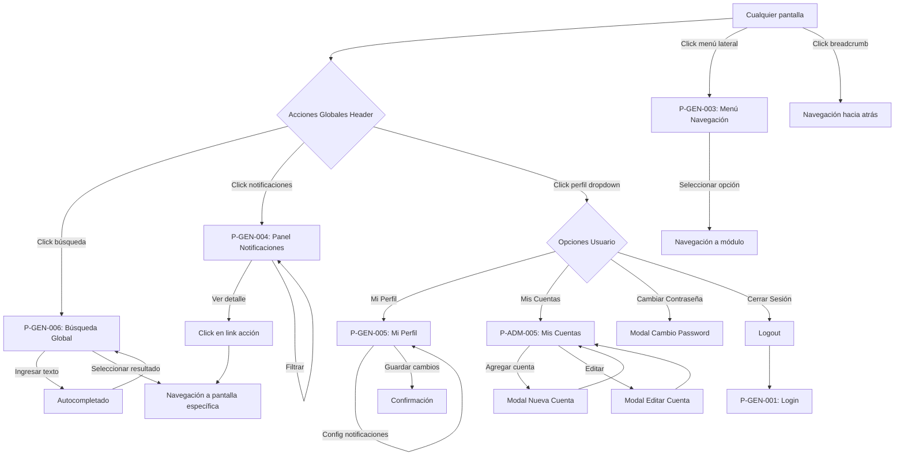
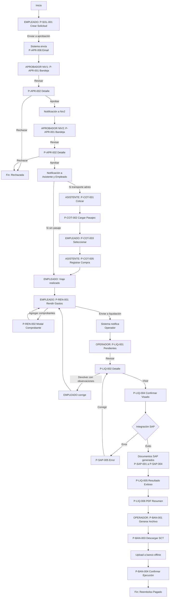

# ANÁLISIS FUNCIONAL - Sistema de Gestión de Viajes CLARO

## CRM Comercial - Prototipo

**Fecha de generación:** 03 de Marzo de 2026

---

## 1. Objetivo y Alcance

### 1.1 Objetivo general

Desarrollar un sistema integral de gestión de viajes y gastos corporativos para América Móvil Perú S.A.C. (CLARO), que automatice el ciclo completo de solicitud, aprobación, rendición y liquidación de gastos de viaje del personal, asegurando el control presupuestario, la trazabilidad contable y el cumplimiento de las políticas corporativas de viáticos. El sistema facilitará la gestión end-to-end desde la creación de la solicitud hasta la contabilización en SAP y el reembolso al empleado.

### 1.2 Alcance del sistema

El sistema cubrirá los siguientes módulos y funcionalidades:

* **Gestión de Solicitudes de Gastos de Viaje:** Registro de solicitudes de viaje por parte de los empleados, indicando origen, destino, fechas, motivo del viaje, tipo de transporte (aéreo/terrestre), modalidad (con/sin anticipo) y presupuesto estimado por conceptos (alojamiento, alimentación, transporte, otros gastos).

* **Proceso de Aprobación Multinivel:** Flujo configurable de aprobaciones con roles de aprobador1, aprobador2 y delegados, incluyendo notificaciones automáticas por correo electrónico, seguimiento de estado y gestión de rechazos con motivo.

* **Cotización y Gestión de Pasajes Aéreos:** Módulo para asistentes de viaje que permite solicitar cotizaciones a agencias, cargar pasajes disponibles mediante plantilla Excel (con datos de aerolínea, vuelo, clase, horarios, tarifa), notificar opciones al solicitante y registrar comprobantes de compra.

* **Registro de Pasajes Terrestres:** Captura de información de viajes por carretera, incluyendo empresa de transporte, distancia, duración, tipo de comprobante y costos asociados.

* **Rendición de Gastos de Viaje:** Registro detallado de comprobantes de gasto (facturas, boletas) por concepto (alojamiento, alimentación, transporte, otros), con cálculo automático de IGV (18%), validación de límites y justificaciones, adjunto de documentos sustentatorios y liquidación de diferencias respecto al anticipo.

* **Integración con SAP FI:** Generación automática de documentos contables en SAP (contabilización de anticipos, descuentos, compensaciones y reembolsos), con asignación a centros de costo, divisiones y cuentas de mayor específicas (ej. 1103013002 COSTOS A COMPROBAR, 1103010541 ANTICIPO FUNCIONARIOS).

* **Generación de Archivos Bancarios:** Creación de archivos SCT para bancos (BCP, Scotiabank) en formatos estándar, agrupando reembolsos por referencia, con selección de cuenta bancaria del empleado (cuando tiene múltiples cuentas) y soporte para monedas Soles y Dólares.

* **Liquidación y Cierre:** Proceso de visado que genera la contabilización definitiva y compensación en SAP, con descarga opcional del archivo bancario para remesa de pagos.

* **Reportes y Dashboards:** Visualización de métricas de gestión de gastos con indicadores clave, monitor de documentos en proceso, histórico de solicitudes y rendiciones por estado.

* **Mantenimiento de Datos Maestros:** Gestión de catálogos de monedas, tipos de gasto, rubros de viáticos, empresas de transporte, aerolíneas, centros de costo y configuración de parámetros del sistema.

### 1.3 Límites del sistema (Fuera de Alcance)

* **Portal del Cliente Externo:** No se incluye funcionalidad para clientes o usuarios externos ajenos a la organización. El sistema está orientado exclusivamente a empleados internos de CLARO.

* **Gestión de Proveedores y Contratos:** La administración de contratos con agencias de viaje, hoteles o proveedores de servicios queda fuera del alcance; el sistema solo registra la información de los comprobantes.

* **Planificación de Viajes Corporativos:** No incluye funcionalidades de planificación estratégica, análisis de rutas óptimas o negociación de tarifas corporativas con proveedores.

* **Gestión de Recursos Humanos:** El sistema no gestiona vacaciones, permisos o aspectos de nómina que no estén directamente relacionados con los gastos de viaje.

* **Facturación a Terceros:** No contempla la emisión de facturas a clientes externos o entidades ajenas a la organización.

* **Integración con Sistemas de Reservas Externas:** El sistema no se integra directamente con plataformas de reserva de vuelos o hoteles (GDS como Amadeus o Sabre); las cotizaciones se cargan manualmente.

* **Módulo SAP Completo:** Aunque existe integración con SAP FI para contabilización, el sistema no reemplaza ni replica toda la funcionalidad de SAP; se limita a la generación de documentos contables específicos para viajes y gastos.

* **Auditoría Financiera Avanzada:** Si bien el sistema mantiene trazabilidad, no incluye herramientas de auditoría forense o análisis de fraude más allá de las validaciones básicas de límites y políticas.

---

## 2. Actores y Roles

| Actor / Rol | Descripción | Permisos / Responsabilidades |
| :---------- | :---------- | :--------------------------- |
| **Empleado / Solicitante** | Colaborador de la organización que requiere realizar un viaje corporativo y debe rendir los gastos efectuados. | Crear solicitudes de gastos de viaje con datos de origen, destino, fechas, motivo, presupuesto estimado y modalidad (con/sin anticipo). Consultar estado de sus solicitudes. Seleccionar pasajes cotizados por el asistente. Registrar la rendición de gastos con comprobantes (facturas, boletas) y anexos digitales. Justificar gastos que excedan límites. Seleccionar cuenta bancaria para reembolso (cuando tenga múltiples cuentas). Consultar histórico de viajes y liquidaciones. |
| **Asistente de Viaje** | Personal administrativo responsable de gestionar las cotizaciones y la compra de pasajes aéreos y terrestres para los solicitantes. | Recibir notificaciones de solicitudes aprobadas que requieren cotización de pasajes. Solicitar cotizaciones a agencias de viaje externas. Cargar opciones de pasajes aéreos mediante plantilla Excel (aerolínea, vuelo, clase, fecha/hora, tarifa). Notificar al solicitante las opciones disponibles. Registrar comprobantes de compra de pasajes. Registrar información de pasajes terrestres (empresa, distancia, duración, costos). |
| **Aprobador Nivel 1** | Jefe directo o responsable inmediato del solicitante con autoridad para aprobar o rechazar una solicitud en primera instancia. | Recibir notificaciones de solicitudes pendientes de aprobación. Visualizar detalle completo de la solicitud (datos del viaje, presupuesto, justificación). Aprobar o rechazar solicitudes con ingreso de motivo de rechazo. Delegar aprobaciones a otro usuario autorizado. Consultar histórico de aprobaciones realizadas. |
| **Aprobador Nivel 2** | Gerente o autoridad superior con poder de aprobación final sobre solicitudes de mayor importe o alcance estratégico. | Recibir notificaciones de solicitudes aprobadas en primer nivel y pendientes de aprobación definitiva. Visualizar detalle completo de la solicitud y aprobación previa. Aprobar o rechazar solicitudes en segunda instancia. Delegar aprobaciones a otro aprobador de nivel 2. Consultar reportes consolidados de gastos de viaje por área/centro de costo. |
| **Administrador del Sistema** | Usuario con privilegios técnicos para configurar parámetros del sistema, gestionar usuarios, roles y datos maestros. | Crear, modificar y dar de baja usuarios del sistema. Asignar roles y permisos. Configurar flujos de aprobación (definir quién es aprobador1 y aprobador2 por área/centro de costo). Mantener catálogos maestros (monedas, tipos de gasto, rubros de viáticos, aerolíneas, empresas de transporte, centros de costo, divisiones, cuentas contables SAP). Configurar límites de gastos por concepto y políticas corporativas. Configurar parámetros de integración con SAP FI (cuentas, divisiones, indicadores CME). Habilitar/deshabilitar funcionalidades del sistema. |
| **Operador de Liquidación / Contabilidad** | Personal del área financiera responsable de revisar las rendiciones, validar comprobantes y ejecutar la liquidación contable en SAP. | Recibir notificaciones de rendiciones completas pendientes de liquidación. Revisar comprobantes adjuntos y validar cumplimiento de políticas (límites, IGV correcto, documentos sustentatorios). Solicitar correcciones o aclaraciones al solicitante. Ejecutar el proceso de visado que genera la contabilización definitiva en SAP. Generar archivos bancarios SCT para remesas de pago (BCP, Scotiabank). Seleccionar lotes de liquidaciones para agrupar pagos. Confirmar ejecución de remesa bancaria. Consultar reportes de liquidaciones procesadas. |
| **Auditor / Revisor** | Rol de control interno que supervisa el cumplimiento de políticas de viáticos y detecta inconsistencias o fraudes. | Acceso de consulta (solo lectura) a todas las solicitudes, rendiciones y liquidaciones del sistema. Consultar histórico completo de transacciones por empleado, centro de costo o período. Visualizar dashboards de métricas de gestión de gastos. Exportar reportes para análisis fuera del sistema. Identificar patrones anómalos en gastos (ej. gastos duplicados, excesos recurrentes). |
| **Sistema SAP FI** | Sistema ERP externo que centraliza la contabilidad corporativa y procesa los documentos contables generados por el sistema de viajes. | Recibir documentos contables de anticipos, compensaciones y reembolsos generados automáticamente por el sistema. Validar disponibilidad presupuestaria en centros de costo. Contabilizar movimientos en cuentas específicas (1103013002 COSTOS A COMPROBAR, 1103010541 ANTICIPO FUNCIONARIOS, 4610130154 GASTO VIÁTICOS, etc.). Asignar número de documento SAP y fecha de contabilización. Proveer confirmación de procesamiento exitoso o mensaje de error para reproceso. |
| **Banco (Sistema Externo)** | Entidad financiera que procesa archivos de pagos masivos (remesas) para reembolsos a empleados. | Recibir archivos SCT con lotes de pagos agrupados por referencia. Validar formato de archivo y datos de cuentas bancarias receptoras. Ejecutar transferencias a cuentas de empleados en Soles o Dólares. Proveer archivo de respuesta con estado de transacciones (exitosas, rechazadas). |

---

## 3. Requerimientos Funcionales

### 3.1 Módulo: Gestión de Solicitudes de Gastos de Viaje

| ID | Requerimiento | Descripción |
| :-- | :-- | :-- |
| RF-SOL-001 | Crear Solicitud de Gastos | El sistema permitirá al empleado crear una solicitud de gastos de viaje ingresando datos obligatorios: origen, destino, fecha de inicio, fecha de fin, motivo del viaje, tipo de transporte (aéreo/terrestre), modalidad (con anticipo/sin anticipo), y presupuesto estimado desglosado por conceptos (alojamiento, alimentación, transporte local, otros gastos). |
| RF-SOL-002 | Calcular Presupuesto Total | El sistema calculará automáticamente el presupuesto total sumando los importes estimados de todos los conceptos ingresados. |
| RF-SOL-003 | Guardar Borrador de Solicitud | El empleado podrá guardar la solicitud como borrador sin enviarla a aprobación, permitiendo ediciones posteriores. |
| RF-SOL-004 | Enviar Solicitud a Aprobación | Una vez completados todos los campos obligatorios, el empleado podrá enviar la solicitud al flujo de aprobación, cambiando su estado a "Pendiente de Aprobación Nivel 1". |
| RF-SOL-005 | Consultar Estado de Solicitud | El empleado podrá consultar en cualquier momento el estado actual de sus solicitudes (Borrador, Pendiente Aprobación, Aprobada, Rechazada, En Rendición, Liquidada), así como el historial de transiciones de estado. |
| RF-SOL-006 | Editar Solicitud en Borrador | El empleado podrá modificar cualquier campo de una solicitud que se encuentre en estado "Borrador". |
| RF-SOL-007 | Cancelar Solicitud | El empleado podrá cancelar una solicitud en estado "Borrador" o "Pendiente de Aprobación", indicando el motivo de la cancelación. |
| RF-SOL-008 | Validar Fecha de Viaje | El sistema validará que la fecha de inicio del viaje sea posterior a la fecha de creación de la solicitud y que la fecha de fin sea posterior o igual a la fecha de inicio. |
| RF-SOL-009 | Asignar Centro de Costo Automático | El sistema asignará automáticamente el centro de costo del empleado basándose en su perfil organizacional (área/departamento). |
| RF-SOL-010 | Registrar Información de Pasaje Aéreo | Para solicitudes con tipo de transporte "Aéreo", el sistema registrará información adicional de vuelos (aerolínea, número de vuelo, clase, fecha/hora de salida y llegada, origen/destino). |
| RF-SOL-011 | Registrar Información de Pasaje Terrestre | Para solicitudes con tipo de transporte "Terrestre", el sistema registrará información adicional (empresa de transporte, distancia en km, duración estimada, ruta). |

### 3.2 Módulo: Proceso de Aprobaciones

| ID | Requerimiento | Descripción |
| :-- | :-- | :-- |
| RF-APR-001 | Notificar Aprobador Nivel 1 | Al enviar una solicitud a aprobación, el sistema enviará automáticamente una notificación por correo electrónico al Aprobador Nivel 1 configurado para el centro de costo del solicitante. |
| RF-APR-002 | Visualizar Solicitudes Pendientes | Los aprobadores podrán visualizar un listado de todas las solicitudes pendientes de su aprobación, con información resumida (solicitante, destino, fechas, monto total, fecha de solicitud). |
| RF-APR-003 | Consultar Detalle de Solicitud | Los aprobadores podrán acceder al detalle completo de cualquier solicitud para revisión, incluyendo todos los conceptos presupuestados y justificaciones. |
| RF-APR-004 | Aprobar Solicitud Nivel 1 | El Aprobador Nivel 1 podrá aprobar una solicitud, generando automáticamente una notificación al Aprobador Nivel 2 y cambiando el estado a "Pendiente de Aprobación Nivel 2". |
| RF-APR-005 | Rechazar Solicitud Nivel 1 | El Aprobador Nivel 1 podrá rechazar una solicitud, debiendo ingresar obligatoriamente el motivo del rechazo. El sistema notificará al solicitante y cambiará el estado a "Rechazada". |
| RF-APR-006 | Aprobar Solicitud Nivel 2 | El Aprobador Nivel 2 podrá aprobar definitivamente una solicitud, cambiando el estado a "Aprobada" y notificando al solicitante y al asistente de viaje (si requiere gestión de pasajes). |
| RF-APR-007 | Rechazar Solicitud Nivel 2 | El Aprobador Nivel 2 podrá rechazar una solicitud en segunda instancia, ingresando el motivo. El sistema notificará al solicitante y al Aprobador Nivel 1, cambiando el estado a "Rechazada". |
| RF-APR-008 | Delegar Aprobación | Los aprobadores podrán delegar temporalmente sus aprobaciones a otro usuario autorizado, especificando el rango de fechas de vigencia de la delegación. |
| RF-APR-009 | Historial de Aprobaciones | El sistema registrará un historial detallado de cada acción de aprobación o rechazo, incluyendo usuario que aprobó, fecha/hora, nivel de aprobación y observaciones. |
| RF-APR-010 | Recordatorio de Aprobación Pendiente | El sistema enviará recordatorios automáticos por correo electrónico a los aprobadores que tengan solicitudes pendientes por más de 48 horas. |

### 3.3 Módulo: Gestión de Cotización y Pasajes

| ID | Requerimiento | Descripción |
| :-- | :-- | :-- |
| RF-COT-001 | Notificar Asistente de Solicitud Aprobada | Cuando una solicitud de viaje con transporte aéreo sea aprobada definitivamente (Nivel 2), el sistema notificará al asistente de viajes para gestión de cotización de pasajes. |
| RF-COT-002 | Listar Solicitudes para Cotización | El asistente de viajes podrá visualizar un listado de solicitudes aprobadas pendientes de cotización de pasajes, con filtros por fecha de viaje, destino y solicitante. |
| RF-COT-003 | Cargar Opciones de Pasajes mediante Excel | El asistente podrá cargar múltiples opciones de pasajes aéreos mediante una plantilla Excel predefinida, incluyendo: aerolínea, número de vuelo, clase (económica, ejecutiva), fecha/hora de salida y llegada, origen/destino, tarifa neta, impuestos, tarifa total, moneda. |
| RF-COT-004 | Validar Plantilla de Pasajes | El sistema validará que la plantilla Excel cargada cumpla con el formato esperado, incluyendo validación de tipos de datos, valores obligatorios y coherencia de fechas/horarios. |
| RF-COT-005 | Registrar Opción de Pasaje Manual | El asistente podrá registrar opciones de pasaje de forma manual (campo por campo) como alternativa a la carga masiva. |
| RF-COT-006 | Notificar Solicitante de Opciones Disponibles | Una vez cargadas las opciones de pasajes, el sistema enviará una notificación por correo al solicitante indicando que tiene opciones disponibles para selección. |
| RF-COT-007 | Visualizar y Comparar Opciones de Pasajes | El solicitante podrá visualizar todas las opciones de pasajes cotizadas para su solicitud, con información completa de horarios, escalas, duración total del viaje y precio. |
| RF-COT-008 | Seleccionar Opción de Pasaje | El solicitante podrá seleccionar la opción de pasaje de su preferencia. El sistema notificará al asistente de viajes la opción seleccionada. |
| RF-COT-009 | Registrar Comprobante de Compra de Pasaje | El asistente de viajes registrará el comprobante de compra del pasaje (factura o boleta) con datos: tipo de documento, número, fecha de emisión, RUC del proveedor, razón social, importe neto, IGV, importe total, y adjuntará el PDF del comprobante. |
| RF-COT-010 | Calcular IGV del Comprobante | El sistema calculará automáticamente el IGV al 18% cuando el asistente ingrese el importe neto de un comprobante tipo Factura. |
| RF-COT-011 | Registrar Pasaje Terrestre | Para solicitudes con transporte terrestre, el asistente registrará información del pasaje: empresa de transporte, tipo de servicio, distancia recorrida (km), duración del viaje, fecha/hora de salida, origen/destino, número de comprobante, importe. |
| RF-COT-012 | Adjuntar Documentos de Pasaje | El sistema permitirá adjuntar archivos PDF de comprobantes y tickets de pasajes (máximo 5 MB por archivo). |

### 3.4 Módulo: Rendición de Gastos

| ID | Requerimiento | Descripción |
| :-- | :-- | :-- |
| RF-REN-001 | Iniciar Rendición de Gastos | Una vez finalizado el viaje, el empleado podrá iniciar el proceso de rendición asociado a la solicitud aprobada, cambiando el estado a "En Rendición". |
| RF-REN-002 | Registrar Comprobante de Gasto | El empleado registrará cada comprobante de gasto efectuado durante el viaje, ingresando: tipo de comprobante (Factura/Boleta), número de documento, RUC/DNI del emisor, razón social/nombre, fecha de emisión, concepto de gasto (alojamiento, alimentación, transporte local, otros), importe neto, IGV, importe total, moneda. |
| RF-REN-003 | Calcular IGV Automático en Rendición | Para comprobantes tipo Factura, el sistema calculará automáticamente el IGV al 18% cuando el empleado ingrese el importe neto. |
| RF-REN-004 | Adjuntar Comprobante Digital | El empleado podrá adjuntar el archivo PDF o imagen (JPG/PNG) del comprobante físico. El sistema validará que el tamaño no exceda 5 MB por archivo. |
| RF-REN-005 | Validar Límites de Gastos | El sistema validará que los gastos registrados por cada concepto no excedan los límites configurados en las políticas corporativas (ej. alojamiento: S/. 350 por noche, alimentación: S/. 100 por día). |
| RF-REN-006 | Justificar Exceso de Límites | Si un gasto excede el límite configurado, el sistema solicitará obligatoriamente al empleado una justificación textual del exceso. |
| RF-REN-007 | Calcular Total Gastado | El sistema calculará automáticamente el total de gastos efectuados sumando todos los comprobantes registrados en la rendición. |
| RF-REN-008 | Calcular Diferencia con Anticipo | Si la solicitud fue con anticipo, el sistema calculará la diferencia entre el monto anticipado y el total gastado, determinando si corresponde reembolso adicional al empleado o descuento/devolución. |
| RF-REN-009 | Editar Comprobante en Rendición | El empleado podrá editar o eliminar comprobantes de gasto mientras la rendición se encuentre en estado "En Rendición" (antes de enviarla a liquidación). |
| RF-REN-010 | Enviar Rendición a Liquidación | Una vez registrados todos los comprobantes, el empleado enviará la rendición al área de contabilidad para su revisión y liquidación, cambiando el estado a "Pendiente de Liquidación". |
| RF-REN-011 | Validar Rendición Completa | El sistema validará que se haya registrado al menos un comprobante antes de permitir el envío a liquidación. |
| RF-REN-012 | Notificar Operador de Rendición Pendiente | Al enviar una rendición a liquidación, el sistema notificará por correo al operador de liquidación asignado. |

### 3.5 Módulo: Integración con SAP FI

| ID | Requerimiento | Descripción |
| :-- | :-- | :-- |
| RF-SAP-001 | Generar Documento de Anticipo en SAP | Para solicitudes aprobadas con modalidad "con anticipo", el sistema generará automáticamente un documento contable de anticipo en SAP FI con: cuenta 1103010541 ANTICIPO FUNCIONARIOS, centro de costo del empleado, división, importe del anticipo, moneda, indicador CME. |
| RF-SAP-002 | Asignar Cuenta Contable según Concepto | El sistema asignará automáticamente la cuenta contable en SAP según el concepto de gasto: 4610130154 para Viáticos, 1103013002 COSTOS A COMPROBAR para anticipos, según configuración de catálogo de cuentas. |
| RF-SAP-003 | Generar Documento de Gasto en SAP | Al liquidar una rendición, el sistema generará documentos contables en SAP para cada concepto de gasto con: cuenta de gasto correspondiente, centro de costo, división, importe neto, IGV, indicador de impuesto. |
| RF-SAP-004 | Generar Documento de Compensación en SAP | Si la rendición es con anticipo, el sistema generará un documento de compensación en SAP que descuenta el anticipo del total de gastos. |
| RF-SAP-005 | Generar Documento de Reembolso/Descuento | Según el resultado de la liquidación (total gastado vs anticipo), el sistema generará un documento de reembolso o descuento en SAP: cuenta deudora si el empleado debe devolver saldo, cuenta acreedora si se le debe reembolsar. |
| RF-SAP-006 | Enviar Datos a SAP mediante Interfaz | El sistema enviará los datos contables a SAP FI mediante interfaz técnica (web service, RFC o archivo plano según arquitectura definida), incluyendo validación de respuesta de SAP. |
| RF-SAP-007 | Registrar Número de Documento SAP | Una vez confirmada la contabilización en SAP, el sistema registrará el número de documento SAP generado y la fecha de contabilización, asociándolos a la liquidación. |
| RF-SAP-008 | Reprocesar Documento SAP Rechazado | Si SAP rechaza un documento contable (ej. por error en cuenta o centro de costo), el sistema permitirá al operador corregir los datos y reenviar el documento. |
| RF-SAP-009 | Validar Disponibilidad Presupuestaria | Antes de generar documentos contables, el sistema consultará a SAP la disponibilidad presupuestaria del centro de costo para el período. |
| RF-SAP-010 | Trazabilidad de Integración SAP | El sistema registrará un log detallado de cada transacción con SAP, incluyendo: fecha/hora, tipo de documento, datos enviados, respuesta de SAP, errores (si los hay). |

### 3.6 Módulo: Generación de Archivos Bancarios

| ID | Requerimiento | Descripción |
| :-- | :-- | :-- |
| RF-BAN-001 | Seleccionar Liquidaciones para Pago | El operador de liquidación podrá seleccionar múltiples liquidaciones contabilizadas en SAP para agrupar en un lote de pago (remesa bancaria). |
| RF-BAN-002 | Agrupar Pagos por Referencia | El sistema agrupará los pagos por número de referencia, sumando los importes de liquidaciones del mismo empleado para generar un único pago por persona. |
| RF-BAN-003 | Validar Cuenta Bancaria del Empleado | El sistema validará que el empleado tenga registrada al menos una cuenta bancaria activa (banco, número de cuenta, moneda). |
| RF-BAN-004 | Seleccionar Cuenta Bancaria | Si el empleado tiene múltiples cuentas bancarias registradas, el sistema permitirá seleccionar en cuál depositar el reembolso. |
| RF-BAN-005 | Generar Archivo SCT para BCP | El sistema generará un archivo de texto en formato SCT (estándar Banco de Crédito del Perú) con los datos de cada pago: tipo de registro, número de cuenta destino, importe, moneda, referencia (número de liquidación). |
| RF-BAN-006 | Generar Archivo SCT para Scotiabank | El sistema generará un archivo de texto en formato SCT (estándar Scotiabank) con estructura específica del banco, adaptando los campos según su especificación técnica. |
| RF-BAN-007 | Convertir Moneda en Archivo Bancario | El sistema incluirá en el archivo bancario los importes en la moneda original (Soles o Dólares) según la cuenta bancaria seleccionada. |
| RF-BAN-008 | Descargar Archivo Bancario | El operador podrá descargar el archivo SCT generado en formato .txt para subirlo al portal del banco. |
| RF-BAN-009 | Registrar Fecha de Generación de Remesa | El sistema registrará la fecha y hora de generación de cada archivo bancario, así como el usuario que lo generó. |
| RF-BAN-010 | Confirmar Ejecución de Remesa | El operador podrá confirmar en el sistema que la remesa bancaria fue ejecutada exitosamente, registrando la fecha de pago efectivo y cambiando el estado de las liquidaciones a "Pagada". |
| RF-BAN-011 | Cancelar Archivo Bancario | El operador podrá anular un archivo bancario generado si detecta errores antes de subirlo al banco, permitiendo regenerar el archivo con correcciones. |

### 3.7 Módulo: Liquidación y Cierre

| ID | Requerimiento | Descripción |
| :-- | :-- | :-- |
| RF-LIQ-001 | Listar Rendiciones Pendientes de Liquidación | El operador de liquidación podrá visualizar todas las rendiciones en estado "Pendiente de Liquidación", con filtros por fecha, solicitante, centro de costo y monto. |
| RF-LIQ-002 | Revisar Comprobantes de Rendición | El operador podrá acceder a todos los comprobantes registrados en una rendición, incluyendo visualización de los archivos PDF adjuntos. |
| RF-LIQ-003 | Solicitar Corrección de Rendición | Si detecta errores o falta de documentación, el operador podrá devolver la rendición al empleado solicitando correcciones, ingresando obligatoriamente las observaciones. El sistema notificará al empleado y cambiará el estado a "En Corrección". |
| RF-LIQ-004 | Corregir Rendición Observada | El empleado recibirá notificación de rendición observada, podrá visualizar las observaciones del operador, corregir los comprobantes y reenviar a liquidación. |
| RF-LIQ-005 | Ejecutar Proceso de Visado | Una vez validados todos los comprobantes, el operador ejecutará el proceso de "visado" que: genera los documentos contables en SAP (anticipos, gastos, compensaciones, reembolsos/descuentos), registra número de documento SAP, marca la rendición como "Liquidada y Visada". |
| RF-LIQ-006 | Calcular Líquido a Pagar | El sistema calculará el importe líquido a pagar al empleado: Total Gastado - Anticipo Recibido + Ajustes (si los hay) = Líquido a Pagar/Descontar. |
| RF-LIQ-007 | Generar Resumen de Liquidación | El sistema generará un documento PDF resumen de la liquidación con: datos del solicitante, datos del viaje, detalle de gastos por concepto, anticipo recibido, total gastado, líquido a pagar, números de documentos SAP, fecha de visado. |
| RF-LIQ-008 | Descargar Resumen de Liquidación | El empleado y el operador podrán descargar el PDF resumen de liquidación para archivo o impresión. |
| RF-LIQ-009 | Consultar Histórico de Liquidaciones | Los usuarios podrán consultar el histórico completo de todas las liquidaciones procesadas, con filtros por fecha, estado, empleado, centro de costo. |
| RF-LIQ-010 | Reversar Liquidación | En casos excepcionales, un usuario con permisos especiales (administrador o supervisor de contabilidad) podrá reversar una liquidación ya visada, ingresando obligatoriamente el motivo. El sistema generará documentos de reversión en SAP. |

### 3.8 Módulo: Reportes y Dashboards

| ID | Requerimiento | Descripción |
| :-- | :-- | :-- |
| RF-REP-001 | Dashboard de Indicadores de Gestión | El sistema mostrará un dashboard con indicadores clave: total de solicitudes del mes, total de gastos autorizados, promedio de días en aprobación, solicitudes por estado (gráfico de torta), top 10 destinos, top 10 solicitantes por gasto total. |
| RF-REP-002 | Reporte de Solicitudes por Período | Generar reporte en Excel con listado de todas las solicitudes en un rango de fechas, incluyendo: solicitante, destino, fecha viaje, monto estimado, monto real, estado, aprobadores, fechas de aprobación. |
| RF-REP-003 | Reporte de Gastos por Centro de Costo | Generar reporte consolidado de gastos por centro de costo y concepto (alojamiento, alimentación, transporte, otros), con totales por mes y comparativo año anterior. |
| RF-REP-004 | Reporte de Liquidaciones Pendientes | Listar todas las rendiciones pendientes de liquidación con más de X días (configurable), incluyendo alertas por antigüedad. |
| RF-REP-005 | Reporte de Comprobantes por Proveedor | Generar reporte de comprobantes registrados agrupados por proveedor (RUC), con totales de gasto por proveedor y concepto. |
| RF-REP-006 | Reporte de Documentos SAP Generados | Listar todos los documentos contables generados en SAP en un rango de fechas, con filtros por tipo de documento, centro de costo, cuenta contable. |
| RF-REP-007 | Reporte de Anticipos Pendientes de Rendir | Generar reporte de empleados con anticipos entregados que aún no han rendido gastos, con antigüedad y saldo pendiente. |
| RF-REP-008 | Exportar Reportes a Excel | Todos los reportes del sistema podrán ser exportados a formato Excel (.xlsx) para análisis fuera del sistema. |
| RF-REP-009 | Programar Envío Automático de Reportes | El administrador podrá configurar el envío automático de reportes específicos por correo electrónico con periodicidad (diaria, semanal, mensual). |
| RF-REP-010 | Monitor de Documentos en Proceso | Pantalla de monitoreo en tiempo real que muestra documentos en cada etapa del proceso (solicitud → aprobación → cotización → rendición → liquidación → pago) con códigos de colores según antigüedad. |

### 3.9 Módulo: Administración y Configuración

| ID | Requerimiento | Descripción |
| :-- | :-- | :-- |
| RF-ADM-001 | Gestión de Usuarios | El administrador podrá crear, modificar y desactivar usuarios del sistema, ingresando: nombre completo, correo electrónico, número de documento, centro de costo, área, cargo, usuario de acceso, contraseña inicial. |
| RF-ADM-002 | Asignación de Roles | El administrador asignará uno o más roles a cada usuario (Empleado, Asistente, Aprobador Nivel 1, Aprobador Nivel 2, Operador Liquidación, Auditor, Administrador). |
| RF-ADM-003 | Configurar Flujo de Aprobación | El administrador configurará por centro de costo quiénes son los Aprobadores Nivel 1 y Nivel 2, permitiendo asignar múltiples aprobadores y definir si es aprobación en serie o paralela. |
| RF-ADM-004 | Gestión de Catálogo de Monedas | Mantener el catálogo de monedas disponibles en el sistema (PEN - Soles, USD - Dólares), con código ISO, símbolo y tipo de cambio de referencia. |
| RF-ADM-005 | Gestión de Catálogo de Tipos de Gasto | Mantener el catálogo de conceptos de gasto (Alojamiento, Alimentación, Transporte Local, Transporte Aéreo, Transporte Terrestre, Otros Gastos), cada uno con su cuenta contable SAP asociada. |
| RF-ADM-006 | Gestión de Límites de Gastos | Configurar los límites máximos de gastos por concepto (ej. Alojamiento: S/. 350/noche, Alimentación: S/. 100/día) para diferentes categorías de empleados o destinos. |
| RF-ADM-007 | Gestión de Catálogo de Aerolíneas | Mantener el catálogo de aerolíneas con código IATA, nombre comercial, país de origen. |
| RF-ADM-008 | Gestión de Empresas de Transporte Terrestre | Mantener el catálogo de empresas de transporte terrestre con RUC, razón social, tipo de servicio (ómnibus, van, taxi). |
| RF-ADM-009 | Gestión de Centros de Costo | Mantener el catálogo de centros de costo con código SAP, descripción, área/departamento, responsable. |
| RF-ADM-010 | Gestión de Cuentas Contables SAP | Mantener el catálogo de cuentas contables con código SAP, descripción, tipo de cuenta (deudora/acreedora), indicador de impuesto. |
| RF-ADM-011 | Configurar Parámetros del Sistema | El administrador configurará parámetros globales: días de recordatorio para aprobaciones pendientes, días de antigüedad para alertas de rendición, tamaño máximo de archivos adjuntos, formato de archivos bancarios por banco, tasa de IGV. |
| RF-ADM-012 | Auditar Acciones de Usuarios | El sistema registrará en un log de auditoría todas las acciones críticas realizadas por usuarios: login, creación/modificación de solicitudes, aprobaciones/rechazos, liquidaciones, modificación de configuraciones, con fecha/hora, IP y usuario. |
| RF-ADM-013 | Gestión de Cuentas Bancarias de Empleados | El administrador o el propio empleado podrá registrar/modificar sus cuentas bancarias personales, ingresando: banco, número de cuenta, tipo de cuenta (ahorros/corriente), moneda, condición de activa/inactiva. |
| RF-ADM-014 | Configurar Plantilla de Correos | El administrador podrá personalizar las plantillas HTML de correos electrónicos enviados por el sistema (notificaciones de aprobación, recordatorios, rechazos) incluyendo logo corporativo y firma. |
| RF-ADM-015 | Backup y Restauración | El administrador podrá ejecutar respaldos manuales de la base de datos y restaurar desde backups previos en caso de contingencia. |

---

## 5. Historias de Usuario

### 5.1 Módulo: Gestión de Solicitudes de Gastos de Viaje

#### **HU-001: Crear solicitud de gastos de viaje**
**Como** empleado
**Quiero** crear una solicitud de gastos de viaje ingresando todos los detalles del viaje (origen, destino, fechas, motivo, presupuesto)
**Para** obtener la autorización y el presupuesto necesario para mi viaje corporativo

**Criterios de aceptación:**
- [ ] El sistema muestra un formulario con campos obligatorios: origen, destino, fecha inicio, fecha fin, motivo, tipo de transporte, modalidad (con/sin anticipo)
- [ ] Puedo ingresar el presupuesto estimado desglosado por conceptos (alojamiento, alimentación, transporte, otros)
- [ ] El sistema calcula automáticamente el presupuesto total sumando todos los conceptos
- [ ] El sistema asigna automáticamente mi centro de costo según mi perfil organizacional
- [ ] Puedo guardar la solicitud como borrador sin enviarla a aprobación
- [ ] El sistema valida que la fecha de inicio sea posterior a hoy y que la fecha fin sea posterior o igual a la fecha inicio
- [ ] Si el transporte es aéreo, puedo ingresar información adicional de vuelos (aerolínea, número de vuelo, clase, horarios)
- [ ] Si el transporte es terrestre, puedo ingresar información adicional (empresa, distancia, duración, ruta)

**ID Requerimientos relacionados:** RF-SOL-001, RF-SOL-002, RF-SOL-008, RF-SOL-009, RF-SOL-010, RF-SOL-011

#### **HU-002: Enviar solicitud a aprobación**
**Como** empleado
**Quiero** enviar mi solicitud de gastos al flujo de aprobación una vez completados todos los datos
**Para** que mis superiores autoricen mi viaje

**Criterios de aceptación:**
- [ ] El sistema valida que todos los campos obligatorios estén completos antes de permitir el envío
- [ ] Al enviar, el estado de la solicitud cambia a "Pendiente de Aprobación Nivel 1"
- [ ] El sistema envía automáticamente una notificación por correo electrónico al Aprobador Nivel 1
- [ ] No puedo editar la solicitud una vez enviada a aprobación
- [ ] Recibo una confirmación en pantalla del envío exitoso

**ID Requerimientos relacionados:** RF-SOL-004, RF-APR-001

#### **HU-003: Consultar estado de mis solicitudes**
**Como** empleado
**Quiero** consultar en cualquier momento el estado actual de mis solicitudes
**Para** hacer seguimiento a su proceso de aprobación y saber cuándo puedo realizar el viaje

**Criterios de aceptación:**
- [ ] Puedo ver un listado de todas mis solicitudes con información resumida (destino, fechas, monto, estado)
- [ ] Puedo filtrar por estado (Borrador, Pendiente Aprobación, Aprobada, Rechazada, En Rendición, Liquidada)
- [ ] Puedo ver el historial de transiciones de estado con fechas y responsables
- [ ] Si la solicitud fue rechazada, puedo visualizar el motivo del rechazo
- [ ] Puedo acceder al detalle completo de cada solicitud

**ID Requerimientos relacionados:** RF-SOL-005

#### **HU-004: Editar o cancelar solicitud en borrador**
**Como** empleado
**Quiero** modificar o cancelar una solicitud que guardé como borrador
**Para** corregir información antes de enviarla a aprobación o descartar solicitudes que ya no proceden

**Criterios de aceptación:**
- [ ] Solo puedo editar solicitudes en estado "Borrador"
- [ ] Puedo modificar cualquier campo de la solicitud
- [ ] Puedo cancelar la solicitud ingresando un motivo de cancelación
- [ ] Al cancelar, el estado cambia a "Cancelada" y no puedo reactivarla
- [ ] El sistema confirma la acción antes de cancelar definitivamente

**ID Requerimientos relacionados:** RF-SOL-006, RF-SOL-007

### 5.2 Módulo: Proceso de Aprobaciones

#### **HU-005: Visualizar solicitudes pendientes de aprobación**
**Como** aprobador (Nivel 1 o Nivel 2)
**Quiero** visualizar todas las solicitudes pendientes de mi aprobación
**Para** revisarlas y tomar una decisión de autorización

**Criterios de aceptación:**
- [ ] Veo un listado de todas las solicitudes pendientes de mi aprobación según mi nivel
- [ ] Cada solicitud muestra información resumida: solicitante, destino, fechas, monto total, fecha de solicitud
- [ ] Puedo filtrar por fecha, solicitante, monto o estado
- [ ] Puedo ordenar la lista por antigüedad o monto
- [ ] El sistema indica visualmente las solicitudes con más de 48 horas pendientes (alerta de prioridad)

**ID Requerimientos relacionados:** RF-APR-002, RF-APR-010

#### **HU-006: Aprobar o rechazar solicitudes (Nivel 1)**
**Como** aprobador de Nivel 1
**Quiero** revisar el detalle de una solicitud y aprobarla o rechazarla
**Para** autorizar o denegar los viajes de mi equipo según políticas y presupuesto

**Criterios de aceptación:**
- [ ] Puedo acceder al detalle completo de la solicitud (todos los datos del viaje y presupuesto)
- [ ] Puedo aprobar la solicitud, generando una notificación al Aprobador Nivel 2 y cambiando el estado a "Pendiente de Aprobación Nivel 2"
- [ ] Puedo rechazar la solicitud, pero el sistema me obliga a ingresar un motivo de rechazo
- [ ] Al rechazar, el sistema notifica al solicitante y cambia el estado a "Rechazada"
- [ ] El sistema registra mi aprobación/rechazo en el historial con fecha, hora y observaciones

**ID Requerimientos relacionados:** RF-APR-003, RF-APR-004, RF-APR-005, RF-APR-009

#### **HU-007: Aprobar o rechazar solicitudes (Nivel 2)**
**Como** aprobador de Nivel 2
**Quiero** revisar solicitudes ya aprobadas en primer nivel y dar aprobación definitiva
**Para** autorizar o denegar viajes de mayor importe o alcance estratégico

**Criterios de aceptación:**
- [ ] Veo solo solicitudes que ya fueron aprobadas por el Aprobador Nivel 1
- [ ] Puedo ver el historial de aprobación previa (quién y cuándo aprobó en Nivel 1)
- [ ] Puedo aprobar definitivamente, cambiando el estado a "Aprobada" y notificando al solicitante y asistente de viaje
- [ ] Puedo rechazar en segunda instancia, ingresando obligatoriamente un motivo
- [ ] Al rechazar, el sistema notifica al solicitante y al Aprobador Nivel 1
- [ ] El sistema registra mi decisión en el historial

**ID Requerimientos relacionados:** RF-APR-003, RF-APR-006, RF-APR-007, RF-APR-009

#### **HU-008: Delegar aprobaciones temporalmente**
**Como** aprobador (Nivel 1 o Nivel 2)
**Quiero** delegar mis aprobaciones a otro usuario autorizado durante un período específico
**Para** asegurar continuidad en el proceso cuando esté ausente (vacaciones, enfermedad)

**Criterios de aceptación:**
- [ ] Puedo seleccionar un usuario autorizado como delegado temporal
- [ ] Debo especificar fecha de inicio y fecha de fin de la delegación
- [ ] Durante el período de delegación, las solicitudes pendientes se asignan automáticamente al delegado
- [ ] El delegado recibe notificaciones de solicitudes pendientes como si fuera el aprobador original
- [ ] Puedo visualizar y cancelar delegaciones activas antes de su fecha de fin
- [ ] El sistema registra todas las delegaciones en el historial de auditoría

**ID Requerimientos relacionados:** RF-APR-008

#### **HU-009: Recibir recordatorios de aprobaciones pendientes**
**Como** aprobador
**Quiero** recibir recordatorios automáticos por correo electrónico de solicitudes pendientes por más tiempo del establecido
**Para** no olvidar aprobar solicitudes y evitar retrasos en los viajes de mi equipo

**Criterios de aceptación:**
- [ ] Si tengo solicitudes pendientes por más de 48 horas, recibo un correo recordatorio
- [ ] El correo incluye un listado de todas las solicitudes pendientes con datos resumidos
- [ ] El correo incluye un enlace directo al sistema para acceder rápidamente
- [ ] Los recordatorios se envían diariamente hasta que se atienda la solicitud

**ID Requerimientos relacionados:** RF-APR-010

### 5.3 Módulo: Gestión de Cotización y Pasajes

#### **HU-010: Recibir solicitudes aprobadas para cotización**
**Como** asistente de viaje
**Quiero** recibir notificaciones de solicitudes aprobadas que requieren gestión de pasajes
**Para** iniciar el proceso de cotización con agencias

**Criterios de aceptación:**
- [ ] Recibo una notificación por correo cuando una solicitud con transporte aéreo es aprobada definitivamente (Nivel 2)
- [ ] Puedo visualizar un listado de solicitudes aprobadas pendientes de cotización
- [ ] Puedo filtrar por fecha de viaje, destino y solicitante
- [ ] Cada solicitud muestra los datos del viaje necesarios para cotizar (origen, destino, fechas, clase solicitada)

**ID Requerimientos relacionados:** RF-COT-001, RF-COT-002

#### **HU-011: Cargar opciones de pasajes mediante plantilla Excel**
**Como** asistente de viaje
**Quiero** cargar múltiples opciones de pasajes aéreos de forma masiva mediante una plantilla Excel
**Para** agilizar el registro de cotizaciones recibidas de las agencias

**Criterios de aceptación:**
- [ ] El sistema proporciona una plantilla Excel predefinida con las columnas requeridas (aerolínea, vuelo, clase, fecha/hora salida, fecha/hora llegada, origen, destino, tarifa neta, impuestos, tarifa total, moneda)
- [ ] Puedo descargar la plantilla, completarla fuera del sistema y cargarla desde mi computadora
- [ ] El sistema valida que la plantilla cumpla con el formato esperado y los tipos de datos
- [ ] Si hay errores en la plantilla, el sistema muestra un mensaje detallado indicando las filas/columnas con problemas
- [ ] Si la validación es exitosa, el sistema carga todas las opciones y me muestra un resumen de opciones registradas
- [ ] El sistema asocia automáticamente las opciones a la solicitud correspondiente

**ID Requerimientos relacionados:** RF-COT-003, RF-COT-004

#### **HU-012: Registrar opciones de pasajes manualmente**
**Como** asistente de viaje
**Quiero** registrar opciones de pasaje de forma manual campo por campo
**Para** cotizaciones individuales o cuando no puedo usar la carga masiva

**Criterios de aceptación:**
- [ ] El sistema muestra un formulario con todos los campos de un pasaje aéreo
- [ ] Puedo ingresar datos: aerolínea, número de vuelo, clase, fechas/horas, origen/destino, tarifas
- [ ] El sistema calcula automáticamente la tarifa total sumando tarifa neta + impuestos
- [ ] Puedo registrar múltiples opciones para la misma solicitud
- [ ] Puedo editar o eliminar opciones antes de notificar al solicitante

**ID Requerimientos relacionados:** RF-COT-005

#### **HU-013: Notificar al solicitante las opciones disponibles**
**Como** asistente de viaje
**Quiero** notificar al solicitante una vez que he cargado todas las opciones de pasajes
**Para** que pueda revisar y seleccionar la opción de su preferencia

**Criterios de aceptación:**
- [ ] Una vez cargadas las opciones, puedo seleccionar la opción "Notificar al solicitante"
- [ ] El sistema envía automáticamente un correo al solicitante indicando que tiene opciones disponibles
- [ ] El correo incluye un enlace directo a la pantalla de selección de pasajes
- [ ] El estado de la solicitud cambia a "Pendiente de Selección de Pasaje"

**ID Requerimientos relacionados:** RF-COT-006

#### **HU-014: Visualizar y seleccionar opciones de pasajes**
**Como** empleado solicitante
**Quiero** visualizar todas las opciones de pasajes cotizadas y seleccionar la de mi preferencia
**Para** confirmar mi itinerario de viaje

**Criterios de aceptación:**
- [ ] Puedo visualizar todas las opciones de pasajes con información completa: aerolínea, número de vuelo, horarios, escalas, duración total, precio
- [ ] Las opciones se muestran en formato comparativo fácil de leer (ej. tarjetas o tabla)
- [ ] Puedo ordenar las opciones por precio, duración o aerolínea
- [ ] Puedo seleccionar una opción haciendo clic en un botón "Seleccionar"
- [ ] El sistema me solicita confirmación antes de confirmar la selección
- [ ] Una vez seleccionada, el sistema notifica al asistente de viaje
- [ ] El estado cambia a "Pasaje Seleccionado - Pendiente de Compra"

**ID Requerimientos relacionados:** RF-COT-007, RF-COT-008

#### **HU-015: Registrar comprobante de compra de pasaje**
**Como** asistente de viaje
**Quiero** registrar el comprobante de compra del pasaje una vez adquirido
**Para** tener trazabilidad del gasto y documentación respaldatoria

**Criterios de aceptación:**
- [ ] Puedo ingresar datos del comprobante: tipo (Factura/Boleta), número, fecha emisión, RUC del proveedor, razón social, importe neto, IGV, importe total
- [ ] Si es Factura, el sistema calcula automáticamente el IGV al 18% cuando ingreso el importe neto
- [ ] Puedo adjuntar el archivo PDF del comprobante (máximo 5 MB)
- [ ] El sistema valida que el archivo sea PDF y no exceda el tamaño máximo
- [ ] Una vez registrado, el estado de la solicitud cambia a "Pasaje Comprado"
- [ ] El solicitante recibe notificación de que su pasaje fue adquirido

**ID Requerimientos relacionados:** RF-COT-009, RF-COT-010, RF-COT-012

#### **HU-016: Registrar información de pasaje terrestre**
**Como** asistente de viaje
**Quiero** registrar información de pasajes terrestres para solicitudes con este tipo de transporte
**Para** documentar el viaje por carretera y sus costos

**Criterios de aceptación:**
- [ ] Para solicitudes con transporte terrestre, puedo ingresar: empresa de transporte, tipo de servicio, distancia (km), duración, fecha/hora salida, origen/destino
- [ ] Puedo registrar el número de comprobante e importe del pasaje
- [ ] Puedo adjuntar el comprobante en PDF
- [ ] El sistema registra esta información asociada a la solicitud
- [ ] El estado cambia a "Pasaje Terrestre Registrado"

**ID Requerimientos relacionados:** RF-COT-011, RF-COT-012

### 5.4 Módulo: Rendición de Gastos

#### **HU-017: Iniciar rendición de gastos**
**Como** empleado
**Quiero** iniciar el proceso de rendición una vez finalizado mi viaje
**Para** registrar todos los comprobantes de gasto y obtener el reembolso correspondiente

**Criterios de aceptación:**
- [ ] Solo puedo iniciar rendición de solicitudes en estado "Aprobada" o "Pasaje Comprado/Registrado"
- [ ] Al iniciar, el estado cambia a "En Rendición"
- [ ] El sistema muestra un formulario para registrar comprobantes de gasto
- [ ] Puedo ver el presupuesto aprobado por concepto como referencia

**ID Requerimientos relacionados:** RF-REN-001

#### **HU-018: Registrar comprobantes de gasto**
**Como** empleado
**Quiero** registrar cada comprobante de gasto que generé durante el viaje (facturas, boletas)
**Para** justificar mis gastos y recibir el reembolso

**Criterios de aceptación:**
- [ ] Puedo agregar múltiples comprobantes, uno por uno
- [ ] Para cada comprobante ingreso: tipo (Factura/Boleta), número, RUC/DNI del emisor, razón social/nombre, fecha emisión, concepto de gasto (alojamiento, alimentación, transporte local, otros)
- [ ] Ingreso importe neto, IGV e importe total; si es Factura, el sistema calcula automáticamente el IGV al 18%
- [ ] Puedo adjuntar el archivo PDF o imagen (JPG/PNG) del comprobante físico (máximo 5 MB por archivo)
- [ ] El sistema valida que el archivo no exceda el tamaño máximo
- [ ] Puedo editar o eliminar comprobantes mientras la rendición esté en estado "En Rendición"

**ID Requerimientos relacionados:** RF-REN-002, RF-REN-003, RF-REN-004, RF-REN-009

#### **HU-019: Validar límites de gastos y justificar excesos**
**Como** empleado
**Quiero** que el sistema valide automáticamente si mis gastos exceden los límites corporativos
**Para** cumplir con las políticas de viáticos o justificar excepciones cuando sean necesarias

**Criterios de aceptación:**
- [ ] Al registrar un comprobante, el sistema valida automáticamente si el gasto excede el límite configurado para ese concepto (ej. alojamiento: S/. 350/noche)
- [ ] Si excede el límite, el sistema muestra una alerta y me solicita obligatoriamente ingresar una justificación textual del exceso
- [ ] No puedo guardar el comprobante sin ingresar la justificación cuando hay exceso
- [ ] La justificación queda registrada asociada al comprobante para revisión del operador de liquidación

**ID Requerimientos relacionados:** RF-REN-005, RF-REN-006

#### **HU-020: Visualizar cálculo de total gastado y diferencia con anticipo**
**Como** empleado
**Quiero** visualizar el total de gastos registrados y la diferencia con el anticipo recibido (si aplica)
**Para** saber si debo devolver saldo o me corresponde reembolso adicional

**Criterios de aceptación:**
- [ ] El sistema calcula y muestra en tiempo real el total de gastos sumando todos los comprobantes registrados
- [ ] Si mi solicitud fue con anticipo, el sistema muestra: Anticipo recibido, Total gastado, Diferencia (a favor o en contra)
- [ ] Si la diferencia es positiva (gasté más del anticipo), veo "Reembolso a recibir: S/. XXX"
- [ ] Si la diferencia es negativa (gasté menos del anticipo), veo "Saldo a devolver: S/. XXX"
- [ ] Esta información se actualiza dinámicamente al agregar/editar/eliminar comprobantes

**ID Requerimientos relacionados:** RF-REN-007, RF-REN-008

#### **HU-021: Enviar rendición a liquidación**
**Como** empleado
**Quiero** enviar mi rendición al área de contabilidad una vez registrados todos los comprobantes
**Para** que revisen, aprueben y procesen el reembolso

**Criterios de aceptación:**
- [ ] El sistema valida que haya registrado al menos un comprobante antes de permitir el envío
- [ ] Puedo revisar un resumen completo de la rendición antes de enviar (todos los comprobantes y montos)
- [ ] Al enviar, el estado cambia a "Pendiente de Liquidación"
- [ ] El sistema envía automáticamente una notificación por correo al operador de liquidación asignado
- [ ] Una vez enviada, no puedo editar ni eliminar comprobantes (solo el operador puede devolver para correcciones)
- [ ] Recibo una confirmación en pantalla del envío exitoso

**ID Requerimientos relacionados:** RF-REN-010, RF-REN-011, RF-REN-012

### 5.5 Módulo: Integración con SAP FI

#### **HU-022: Generar documentos contables en SAP automáticamente**
**Como** operador de liquidación
**Quiero** que el sistema genere automáticamente los documentos contables en SAP al ejecutar el visado
**Para** no tener que registrar manualmente cada transacción en SAP y evitar errores

**Criterios de aceptación:**
- [ ] Al ejecutar el proceso de visado de una rendición, el sistema genera automáticamente los documentos contables necesarios en SAP FI
- [ ] Para solicitudes con anticipo, se genera documento de anticipo (cuenta 1103010541 ANTICIPO FUNCIONARIOS)
- [ ] Se generan documentos de gasto por cada concepto (alojamiento, alimentación, transporte, etc.) con sus cuentas contables correspondientes
- [ ] Si hay anticipo, se genera documento de compensación que descuenta el anticipo del total de gastos
- [ ] Se genera documento de reembolso (si el empleado gastó más que el anticipo) o descuento (si gastó menos)
- [ ] Cada documento incluye: centro de costo, división, importe, moneda, indicador CME
- [ ] El sistema valida disponibilidad presupuestaria en SAP antes de generar los documentos

**ID Requerimientos relacionados:** RF-SAP-001, RF-SAP-002, RF-SAP-003, RF-SAP-004, RF-SAP-005, RF-SAP-009

#### **HU-023: Registrar número de documento SAP y trazabilidad**
**Como** operador de liquidación
**Quiero** que el sistema registre automáticamente los números de documento SAP generados
**Para** mantener trazabilidad completa entre el sistema de viajes y SAP

**Criterios de aceptación:**
- [ ] Una vez confirmada la contabilización en SAP, el sistema registra automáticamente el número de documento SAP generado
- [ ] Se registra la fecha de contabilización SAP
- [ ] Estos datos quedan asociados permanentemente a la liquidación
- [ ] Puedo consultar los números de documento SAP desde el detalle de la liquidación
- [ ] El sistema registra un log detallado de cada transacción con SAP: fecha/hora, tipo de documento, datos enviados, respuesta de SAP

**ID Requerimientos relacionados:** RF-SAP-007, RF-SAP-010

#### **HU-024: Reprocesar documentos SAP rechazados**
**Como** operador de liquidación
**Quiero** corregir datos y reenviar documentos contables que fueron rechazados por SAP
**Para** resolver errores y completar la contabilización sin perder información

**Criterios de aceptación:**
- [ ] Si SAP rechaza un documento (ej. error en cuenta o centro de costo), el sistema me notifica del error con el mensaje de SAP
- [ ] Puedo acceder a la liquidación y editar los datos contables (cuenta, centro de costo, división)
- [ ] Puedo seleccionar la opción "Reprocesar en SAP"
- [ ] El sistema reenvía el documento corregido a SAP
- [ ] Si el reenvío es exitoso, se registra el nuevo número de documento SAP
- [ ] Todo el proceso de rechazo y reproceso queda registrado en el log de auditoría

**ID Requerimientos relacionados:** RF-SAP-008, RF-SAP-010

### 5.6 Módulo: Generación de Archivos Bancarios

#### **HU-025: Seleccionar liquidaciones y generar archivo bancario**
**Como** operador de liquidación
**Quiero** seleccionar múltiples liquidaciones y generar un archivo bancario para remesa de pagos
**Para** agrupar reembolsos en un solo lote y ejecutar pagos masivos a empleados

**Criterios de aceptación:**
- [ ] Puedo visualizar todas las liquidaciones contabilizadas en SAP que están pendientes de pago
- [ ] Puedo seleccionar múltiples liquidaciones mediante checkboxes
- [ ] El sistema agrupa los pagos por número de referencia, sumando importes de liquidaciones del mismo empleado para generar un único pago
- [ ] El sistema valida que cada empleado tenga registrada al menos una cuenta bancaria activa
- [ ] Si un empleado tiene múltiples cuentas, puedo seleccionar en cuál depositar
- [ ] Puedo elegir el formato del archivo: BCP o Scotiabank
- [ ] El sistema genera el archivo SCT en formato de texto (.txt) según el estándar del banco seleccionado
- [ ] El archivo incluye: tipo de registro, número de cuenta destino, importe, moneda, referencia (número de liquidación)

**ID Requerimientos relacionados:** RF-BAN-001, RF-BAN-002, RF-BAN-003, RF-BAN-004, RF-BAN-005, RF-BAN-006, RF-BAN-007

#### **HU-026: Descargar y confirmar ejecución de remesa bancaria**
**Como** operador de liquidación
**Quiero** descargar el archivo bancario generado y confirmar su ejecución en el banco
**Para** completar el proceso de pago a empleados

**Criterios de aceptación:**
- [ ] Una vez generado el archivo, puedo descargarlo en formato .txt desde el sistema
- [ ] El sistema registra la fecha y hora de generación del archivo, así como mi usuario
- [ ] Puedo subir el archivo al portal del banco y ejecutar la remesa
- [ ] Una vez ejecutada la remesa en el banco, puedo volver al sistema y confirmar la ejecución
- [ ] Al confirmar, ingreso la fecha de pago efectivo
- [ ] El estado de todas las liquidaciones incluidas en la remesa cambia a "Pagada"
- [ ] Se notifica por correo a cada empleado que su reembolso fue procesado

**ID Requerimientos relacionados:** RF-BAN-008, RF-BAN-009, RF-BAN-010

#### **HU-027: Anular archivo bancario generado**
**Como** operador de liquidación
**Quiero** anular un archivo bancario generado si detecto errores antes de subirlo al banco
**Para** corregir los errores y regenerar el archivo correctamente

**Criterios de aceptación:**
- [ ] Puedo seleccionar un archivo bancario generado que aún no se haya confirmado como ejecutado
- [ ] Puedo anular el archivo, ingresando un motivo de anulación
- [ ] Al anular, las liquidaciones incluidas vuelven a estado "Pendiente de Pago" (disponibles para incluir en un nuevo archivo)
- [ ] El archivo anulado queda registrado en el historial con estado "Anulado" para auditoría
- [ ] Puedo regenerar un nuevo archivo con las correcciones necesarias

**ID Requerimientos relacionados:** RF-BAN-011

### 5.7 Módulo: Liquidación y Cierre

#### **HU-028: Visualizar rendiciones pendientes de liquidación**
**Como** operador de liquidación
**Quiero** visualizar todas las rendiciones pendientes de liquidación
**Para** priorizarlas y procesarlas oportunamente

**Criterios de aceptación:**
- [ ] Veo un listado de todas las rendiciones en estado "Pendiente de Liquidación"
- [ ] Cada rendición muestra: solicitante, destino, fecha de viaje, total gastado, anticipo, diferencia, fecha de envío
- [ ] Puedo filtrar por fecha, solicitante, centro de costo y monto
- [ ] Puedo ordenar por antigüedad o monto
- [ ] El sistema indica visualmente rendiciones con más de X días pendientes (alerta de prioridad)

**ID Requerimientos relacionados:** RF-LIQ-001

#### **HU-029: Revisar comprobantes y solicitar correcciones**
**Como** operador de liquidación
**Quiero** revisar todos los comprobantes de una rendición y solicitar correcciones si detecto errores
**Para** asegurar que la documentación esté completa y correcta antes de contabilizar

**Criterios de aceptación:**
- [ ] Puedo acceder al detalle de cada comprobante registrado en la rendición
- [ ] Puedo visualizar los archivos PDF adjuntos de cada comprobante
- [ ] Puedo ver las justificaciones de excesos de límites
- [ ] Si detecto errores o falta documentación, puedo seleccionar "Devolver para corrección"
- [ ] Debo ingresar obligatoriamente las observaciones detallando qué debe corregirse
- [ ] Al devolver, el estado cambia a "En Corrección" y el empleado recibe notificación con las observaciones
- [ ] El empleado puede corregir y reenviar; yo recibo notificación de reenvío

**ID Requerimientos relacionados:** RF-LIQ-002, RF-LIQ-003, RF-LIQ-004

#### **HU-030: Ejecutar proceso de visado y liquidación**
**Como** operador de liquidación
**Quiero** ejecutar el proceso de visado una vez validados todos los comprobantes
**Para** generar la contabilización definitiva en SAP y habilitar el pago al empleado

**Criterios de aceptación:**
- [ ] Solo puedo ejecutar el visado en rendiciones completamente validadas (sin observaciones pendientes)
- [ ] Al ejecutar el visado, el sistema: genera automáticamente todos los documentos contables en SAP (anticipos, gastos, compensaciones, reembolsos/descuentos), registra números de documento SAP y fechas de contabilización, cambia el estado a "Liquidada y Visada"
- [ ] El sistema calcula el importe líquido a pagar: Total Gastado - Anticipo Recibido = Líquido a Pagar/Descontar
- [ ] Se genera automáticamente un PDF resumen de liquidación con todos los datos
- [ ] El empleado recibe notificación de que su rendición fue liquidada
- [ ] Si hay errores en la contabilización SAP, el sistema me notifica y no cambia el estado (puedo corregir y reintentar)

**ID Requerimientos relacionados:** RF-LIQ-005, RF-LIQ-006, RF-SAP-001 a RF-SAP-007

#### **HU-031: Descargar resumen de liquidación**
**Como** empleado u operador de liquidación
**Quiero** descargar un PDF resumen de la liquidación
**Para** tener un documento oficial de referencia y archivo

**Criterios de aceptación:**
- [ ] Una vez liquidada una rendición, puedo descargar un PDF resumen
- [ ] El PDF incluye: datos del solicitante, datos del viaje (origen, destino, fechas), detalle de gastos por concepto con comprobantes, anticipo recibido (si aplica), total gastado, líquido a pagar/descontar, números de documentos SAP, fecha de visado, firma digital del operador
- [ ] El PDF tiene formato profesional con logo corporativo
- [ ] Puedo descargar el PDF cuantas veces sea necesario

**ID Requerimientos relacionados:** RF-LIQ-007, RF-LIQ-008

#### **HU-032: Consultar histórico de liquidaciones**
**Como** empleado, operador o auditor
**Quiero** consultar el histórico completo de liquidaciones procesadas
**Para** hacer seguimiento, análisis o auditorías

**Criterios de aceptación:**
- [ ] Puedo visualizar todas las liquidaciones procesadas (según mis permisos: mis liquidaciones como empleado, todas como operador/auditor)
- [ ] Puedo filtrar por fecha, estado, empleado, centro de costo
- [ ] Puedo acceder al detalle completo de cada liquidación
- [ ] Puedo exportar el listado a Excel
- [ ] Como auditor, tengo acceso de solo lectura a todas las liquidaciones

**ID Requerimientos relacionados:** RF-LIQ-009

#### **HU-033: Reversar liquidación en casos excepcionales**
**Como** administrador o supervisor de contabilidad
**Quiero** reversar una liquidación ya visada en casos excepcionales
**Para** corregir errores críticos detectados después del visado

**Criterios de aceptación:**
- [ ] Solo usuarios con permisos especiales (administrador, supervisor) pueden reversar liquidaciones
- [ ] Puedo seleccionar una liquidación en estado "Liquidada y Visada" o "Pagada"
- [ ] Debo ingresar obligatoriamente el motivo detallado de la reversión
- [ ] El sistema me solicita confirmación adicional (doble confirmación)
- [ ] Al confirmar, el sistema genera automáticamente documentos de reversión en SAP
- [ ] El estado de la liquidación cambia a "Reversada - Pendiente de Corrección"
- [ ] Si la liquidación ya fue pagada, el sistema alerta que debe gestionarse la devolución del pago
- [ ] Toda la operación queda registrada en el log de auditoría

**ID Requerimientos relacionados:** RF-LIQ-010

### 5.8 Módulo: Reportes y Dashboards

#### **HU-034: Visualizar dashboard de indicadores de gestión**
**Como** gerente o aprobador de nivel 2
**Quiero** visualizar un dashboard con indicadores clave de gestión de gastos de viaje
**Para** monitorear el comportamiento de los gastos y tomar decisiones estratégicas

**Criterios de aceptación:**
- [ ] El dashboard muestra indicadores clave: total de solicitudes del mes, total de gastos autorizados, promedio de días en aprobación, distribución de solicitudes por estado (gráfico de torta), top 10 destinos más visitados, top 10 solicitantes con mayor gasto total
- [ ] Puedo seleccionar un rango de fechas para filtrar los indicadores
- [ ] Puedo filtrar por centro de costo o área
- [ ] Los gráficos son interactivos (puedo hacer clic para ver detalle)
- [ ] El dashboard se actualiza automáticamente con datos en tiempo real

**ID Requerimientos relacionados:** RF-REP-001

#### **HU-035: Generar reporte de solicitudes por período**
**Como** auditor u operador
**Quiero** generar un reporte Excel con todas las solicitudes en un rango de fechas
**Para** análisis detallado fuera del sistema

**Criterios de aceptación:**
- [ ] Puedo seleccionar fecha de inicio y fecha de fin
- [ ] Puedo filtrar adicionalmente por estado, centro de costo o solicitante
- [ ] El sistema genera un archivo Excel con columnas: solicitante, destino, fecha viaje, monto estimado, monto real, estado, aprobador nivel 1, aprobador nivel 2, fechas de aprobación, fecha de liquidación
- [ ] Puedo descargar el archivo Excel generado
- [ ] El reporte incluye totales al final

**ID Requerimientos relacionados:** RF-REP-002, RF-REP-008

#### **HU-036: Generar reporte de gastos por centro de costo**
**Como** gerente o controlador financiero
**Quiero** generar un reporte consolidado de gastos por centro de costo y concepto
**Para** analizar la distribución de gastos de viaje por área y concepto

**Criterios de aceptación:**
- [ ] Puedo seleccionar uno o múltiples centros de costo
- [ ] Puedo seleccionar el período (mes/año)
- [ ] El reporte muestra gastos agrupados por centro de costo y subagrupados por concepto (alojamiento, alimentación, transporte, otros)
- [ ] Incluye totales por centro de costo y totales generales
- [ ] Incluye comparativo con el año anterior (mismo período)
- [ ] Puedo exportar a Excel

**ID Requerimientos relacionados:** RF-REP-003, RF-REP-008

#### **HU-037: Generar reporte de liquidaciones pendientes**
**Como** operador o supervisor de contabilidad
**Quiero** generar un reporte de rendiciones pendientes de liquidación con más de X días
**Para** identificar cuellos de botella y priorizar procesamiento

**Criterios de aceptación:**
- [ ] Puedo configurar el número de días de antigüedad (ej. más de 7 días)
- [ ] El reporte lista todas las rendiciones pendientes que excedan ese plazo
- [ ] Incluye: solicitante, destino, fecha de viaje, fecha de envío a liquidación, días pendientes, monto total
- [ ] Los registros se ordenan por antigüedad (más antiguos primero)
- [ ] El sistema alerta visualmente los casos más críticos (ej. más de 15 días en rojo)
- [ ] Puedo exportar a Excel

**ID Requerimientos relacionados:** RF-REP-004

#### **HU-038: Monitorear documentos en proceso en tiempo real**
**Como** operador o supervisor
**Quiero** visualizar un monitor en tiempo real de documentos en cada etapa del proceso
**Para** identificar rápidamente dónde hay retrasos o acumulación

**Criterios de aceptación:**
- [ ] El sistema muestra una pantalla tipo "tablero" con columnas por etapa: Solicitud → Aprobación → Cotización → Rendición → Liquidación → Pago
- [ ] En cada columna veo la cantidad de documentos en esa etapa
- [ ] Uso códigos de colores según antigüedad: verde (reciente), amarillo (moderado), rojo (crítico)
- [ ] Puedo hacer clic en cada columna para ver el listado de documentos en esa etapa
- [ ] El tablero se actualiza automáticamente cada X minutos (configurable)

**ID Requerimientos relacionados:** RF-REP-010

### 5.9 Módulo: Administración y Configuración

#### **HU-039: Gestionar usuarios del sistema**
**Como** administrador del sistema
**Quiero** crear, modificar y desactivar usuarios
**Para** controlar el acceso al sistema según altas, bajas y cambios en el personal

**Criterios de aceptación:**
- [ ] Puedo crear un usuario nuevo ingresando: nombre completo, correo electrónico, número de documento, centro de costo, área, cargo, usuario de acceso, contraseña inicial
- [ ] Puedo asignar uno o más roles al usuario (Empleado, Asistente, Aprobador Nivel 1, Aprobador Nivel 2, Operador Liquidación, Auditor, Administrador)
- [ ] Puedo editar datos de usuarios existentes
- [ ] Puedo desactivar usuarios (no eliminar, para mantener trazabilidad histórica)
- [ ] Los usuarios desactivados no pueden acceder al sistema
- [ ] Puedo reactivar usuarios previamente desactivados
- [ ] El sistema registra todas las operaciones en el log de auditoría

**ID Requerimientos relacionados:** RF-ADM-001, RF-ADM-002

#### **HU-040: Configurar flujos de aprobación por centro de costo**
**Como** administrador del sistema
**Quiero** configurar quiénes son los aprobadores Nivel 1 y Nivel 2 para cada centro de costo
**Para** asegurar que las solicitudes se enruten automáticamente a los aprobadores correctos

**Criterios de aceptación:**
- [ ] Puedo seleccionar un centro de costo
- [ ] Puedo asignar uno o múltiples usuarios como Aprobadores Nivel 1 para ese centro de costo
- [ ] Puedo asignar uno o múltiples usuarios como Aprobadores Nivel 2
- [ ] Puedo definir si la aprobación es en serie (secuencial) o en paralelo (cualquiera puede aprobar)
- [ ] Puedo modificar estas configuraciones en cualquier momento
- [ ] Los cambios aplican solo para solicitudes nuevas (no afectan solicitudes en proceso)

**ID Requerimientos relacionados:** RF-ADM-003

#### **HU-041: Mantener catálogos maestros del sistema**
**Como** administrador del sistema
**Quiero** mantener los catálogos maestros (monedas, tipos de gasto, aerolíneas, centros de costo, cuentas SAP, etc.)
**Para** que el sistema cuente con información actualizada y correcta

**Criterios de aceptación:**
- [ ] Puedo acceder a un módulo de administración de maestros con las siguientes opciones: Monedas (código ISO, símbolo, tipo de cambio), Tipos de Gasto (conceptos con cuenta contable SAP asociada), Límites de Gastos (máximos por concepto), Aerolíneas (código IATA, nombre), Empresas de Transporte Terrestre (RUC, razón social, tipo), Centros de Costo (código SAP, descripción, área, responsable), Cuentas Contables SAP (código, descripción, tipo)
- [ ] Para cada catálogo puedo: agregar nuevos registros, editar registros existentes, desactivar registros (no eliminar), buscar y filtrar registros
- [ ] Todos los cambios quedan registrados en auditoría

**ID Requerimientos relacionados:** RF-ADM-004, RF-ADM-005, RF-ADM-006, RF-ADM-007, RF-ADM-008, RF-ADM-009, RF-ADM-010

#### **HU-042: Configurar parámetros globales del sistema**
**Como** administrador del sistema
**Quiero** configurar parámetros globales que afectan el comportamiento del sistema
**Para** adaptar el sistema a las políticas corporativas y necesidades operativas

**Criterios de aceptación:**
- [ ] Puedo configurar: días de recordatorio para aprobaciones pendientes (ej. 2 días), días de antigüedad para alertas de rendición pendiente (ej. 7 días), tamaño máximo de archivos adjuntos (ej. 5 MB), formato de archivos bancarios por banco (BCP, Scotiabank), tasa de IGV (ej. 18%)
- [ ] Cada parámetro tiene una descripción clara de su propósito
- [ ] Puedo modificar los valores y guardar los cambios
- [ ] Los cambios aplican inmediatamente en todo el sistema
- [ ] El sistema valida que los valores ingresados sean coherentes (ej. porcentajes entre 0-100, días mayor a 0)

**ID Requerimientos relacionados:** RF-ADM-011

#### **HU-043: Gestionar cuentas bancarias de empleados**
**Como** empleado o administrador
**Quiero** registrar y mantener actualizadas mis cuentas bancarias personales
**Para** que los reembolsos se depositen correctamente

**Criterios de aceptación:**
- [ ] Como empleado, puedo acceder a "Mis Cuentas Bancarias" y agregar una o más cuentas
- [ ] Para cada cuenta ingreso: banco, número de cuenta, tipo de cuenta (ahorros/corriente), moneda (Soles/Dólares)
- [ ] Puedo marcar una cuenta como "preferida" (por defecto para reembolsos)
- [ ] Puedo desactivar cuentas que ya no uso
- [ ] El administrador puede ver y editar cuentas de cualquier empleado
- [ ] Al generar archivos bancarios, el sistema usa la cuenta activa preferida o permite seleccionar

**ID Requerimientos relacionados:** RF-ADM-013, RF-BAN-003, RF-BAN-004

#### **HU-044: Consultar log de auditoría del sistema**
**Como** administrador o auditor
**Quiero** consultar el log de auditoría con todas las acciones críticas realizadas por usuarios
**Para** realizar auditorías de seguridad y rastrear operaciones

**Criterios de aceptación:**
- [ ] Puedo acceder al módulo de auditoría
- [ ] El log registra: login de usuarios, creación/modificación de solicitudes, aprobaciones/rechazos, liquidaciones, modificación de configuraciones, desactivación de usuarios, reversiones, cada registro incluye: fecha/hora, usuario, acción realizada, IP de origen, datos modificados (antes/después si aplica)
- [ ] Puedo filtrar por rango de fechas, usuario, tipo de acción
- [ ] Puedo buscar por texto libre (ej. número de solicitud)
- [ ] Puedo exportar el log a Excel
- [ ] El log es de solo lectura (no se puede editar ni eliminar registros)

**ID Requerimientos relacionados:** RF-ADM-012

---

## 10. Interfaces de Usuario

### 10.1. Módulo: Gestión de Solicitudes de Gastos de Viaje

| Pantalla (ID) | Tipo | Descripción general y Componentes Clave | Roles con acceso | Historia(s) de Usuario |
| :------------ | :--- | :-------------------------------------- | :--------------- | :--------------------- |
| P-SOL-001 | Formulario | **Solicitud de Gasto - Registro**: Formulario principal para crear/editar solicitudes de gastos de viaje. **Componentes**: Campos de datos del solicitante (Código, Nombre, Área, Centro de Costos, Centro Gestor), Jefe Inmediato, Tipo de Solicitud (Gastos de Viaje), Modalidad (Con anticipo/Sin anticipo), Origen-Destino, Fechas (Inicio/Fin), Motivo del viaje, Tipo de transporte (Aéreo/Terrestre), Sustento adjunto (archivo), Tabla de presupuesto desglosado por conceptos (Alojamiento, Alimentación, Transporte, Otros Gastos) con montos y justificaciones, Monto total calculado automáticamente, Botones: Crear, Cancelar, Descargar, Guardar como borrador, Enviar a aprobación. **Basado en imágenes**: img2, img53, img87, img110, img171, img199, img295. | Empleado/Solicitante | HU-001, HU-002, HU-004 |
| P-SOL-002 | Listado | **Solicitudes Pendientes - Vista Solicitante**: Listado de todas las solicitudes del empleado con filtros y acciones. **Componentes**: Tabla con columnas (N° Solicitud, Tipo, Fecha Inicio, Fecha Fin, Estado, Monto Solicitado, Moneda, Fecha límite rendición, Anticipo, Motivo Rechazo, Aprobador), Botones de acción por registro (Ver detalle, Editar, Cancelar), Filtros por estado, rango de fechas, Paginación. **Basado en imágenes**: img53, img110, img171, img199. | Empleado/Solicitante | HU-003, HU-004 |
| P-SOL-003 | Modal/Confirmación | **Confirmación de Envío**: Ventana modal que confirma el envío exitoso de solicitud a aprobación. **Componentes**: Mensaje de confirmación "Se envió a aprobación la solicitud de gastos de viaje N° XXXXX", Icono de éxito (checkmark), Botón OK. **Basado en imágenes**: img171. | Empleado/Solicitante | HU-002 |
| P-SOL-004 | Detalle | **Detalle de Solicitud - Vista de Consulta**: Pantalla de consulta detallada de una solicitud específica. **Componentes**: Todos los datos de la solicitud en modo solo lectura, Historial de estados y transiciones, Datos de aprobaciones (aprobador, fecha, observaciones), Documento contable anticipo (si aplica), Archivos adjuntos descargables, Estado actual destacado visualmente. **Basado en imágenes**: img43, img52, img113, img169, img187. | Empleado/Solicitante, Aprobador, Auditor, Operador | HU-003 |
| P-SOL-005 | Formulario | **Registro de Pasaje Terrestre**: Formulario para ingresar información de viajes terrestres asociados a una solicitud. **Componentes**: N° Solicitud, Día de Salida, Destino, Justificación, Observaciones, Compañía de transporte, Moneda, Duración (horas), Distancia (km), Monto total, Tipo comprobante (FACTURA/BOLETA), Número documento, Afecto IGV (Sí/No), Tasa impuesto (dropdown), Monto IGV calculado, Botones: Guardar, Cancelar. **Basado en imágenes**: img29, img206, img235, img267. | Empleado/Solicitante, Asistente de Viaje | HU-001 (transporte terrestre) |

### 10.2. Módulo: Proceso de Aprobaciones

| Pantalla (ID) | Tipo | Descripción general y Componentes Clave | Roles con acceso | Historia(s) de Usuario |
| :------------ | :--- | :-------------------------------------- | :--------------- | :--------------------- |
| P-APR-001 | Bandeja | **Bandeja de Aprobaciones - Pendientes**: Bandeja de trabajo para aprobadores con solicitudes pendientes. **Componentes**: Contador de pendientes en tab "Pendientes (X)", Filtros desplegables (solicitante, fecha, monto, estado), Listado con información resumida (N° Solicitud, Tipo, Solicitante, Destino, Fecha Viaje, Monto, Moneda, Fecha Solicitud), Panel derecho con detalle de registro seleccionado, Mensaje "Sin datos" cuando no hay pendientes, Botones principales: Aprobar, Rechazar. **Basado en imágenes**: img63, img77, img78, img93, img242, img256. | Aprobador Nivel 1, Aprobador Nivel 2 | HU-005, HU-006, HU-007 |
| P-APR-002 | Detalle | **Detalle de Solicitud para Aprobación**: Panel derecho de bandeja o pantalla completa con información detallada de la solicitud a aprobar. **Componentes**: Datos del solicitante (Código, Nombre, Área, Centro Costo), Datos del viaje (País, Ciudad, Provincia Destino, Fecha Inicio/Fin, Actividad, Modalidad, Tipo), Tabla de presupuesto desglosado por concepto con montos y justificaciones, Monto total solicitado, Sustento/Motivo del viaje, Botones: Aprobar, Rechazar. **Basado en imágenes**: img13, img78, img108, img242, img271. | Aprobador Nivel 1, Aprobador Nivel 2 | HU-006, HU-007 |
| P-APR-003 | Modal/Formulario | **Rechazo de Solicitud**: Modal para ingresar motivo de rechazo. **Componentes**: Campo de texto obligatorio "Motivo de rechazo", Contador de caracteres (min/max), Botones: Confirmar Rechazo, Cancelar. | Aprobador Nivel 1, Aprobador Nivel 2 | HU-006, HU-007 |
| P-APR-004 | Modal/Confirmación | **Confirmación de Aprobación**: Ventana modal que confirma aprobación exitosa. **Componentes**: Mensaje "Se ha aprobado la Solicitud de gastos de viaje exitosamente", Icono de éxito, Botón OK. **Basado en imágenes**: img63. | Aprobador Nivel 1, Aprobador Nivel 2 | HU-006, HU-007 |
| P-APR-005 | Formulario | **Delegación de Aprobaciones**: Pantalla para configurar delegaciones temporales. **Componentes**: Tabla de configuración actual con columnas (Código Aprobador, Nombre Aprobador, Código Delegado, Nombre Delegado, Fecha Inicio, Fecha Fin, Estado), Formulario para nueva delegación (Seleccionar delegado, Rango de fechas), Botones: Agregar Delegación, Cancelar Delegación, Guardar. **Basado en imágenes**: img114. | Aprobador Nivel 1, Aprobador Nivel 2 | HU-008 |
| P-APR-006 | Email | **Notificación de Solicitud Pendiente**: Plantilla de correo electrónico enviado a aprobadores. **Componentes**: Logo corporativo, Saludo personalizado, Descripción de la solicitud pendiente (N°, Solicitante, Monto, Destino, Fechas), Botón/Link directo para acceder al sistema, Recordatorio de plazo (48h), Firma digital. **Basado en imágenes**: img14, img23, img30, img38, img44, img66, img99, img106, img154, img194, img204, img225, img230, img258, img281, img297. | Aprobador Nivel 1, Aprobador Nivel 2 | HU-005, HU-009 |

### 10.3. Módulo: Gestión de Cotización y Pasajes Aéreos

| Pantalla (ID) | Tipo | Descripción general y Componentes Clave | Roles con acceso | Historia(s) de Usuario |
| :------------ | :--- | :-------------------------------------- | :--------------- | :--------------------- |
| P-COT-001 | Listado | **Solicitudes Pendientes de Cotización**: Listado de solicitudes aprobadas que requieren gestión de pasajes aéreos. **Componentes**: Filtros (Fecha viaje, Destino, Solicitante, Rango de fechas), Tabla con columnas (N° Solicitud, Solicitante, Origen, Destino, Fecha Salida/Llegada, Clase solicitada, Estado), Botón de acción: Iniciar Cotización. | Asistente de Viaje | HU-010 |
| P-COT-002 | Formulario | **Cargar Pasajes mediante Plantilla Excel**: Pantalla para carga masiva de opciones de pasajes. **Componentes**: N° Solicitud asociada, Mensaje informativo: "Recordar que al momento de cargar los pasajes disponibles mediante la plantilla, el campo Aerolínea se debe registrar con el código de identificación. Ver códigos aquí: [link]", Botones: Descargar Plantilla, Cargar Plantilla, Tabla editable con columnas (Aerolínea, Vuelo, Clase, Origen, Destino, Hora Salida, Hora Llegada, Duración, Aeronave, Escalas, Tarifa, Moneda, Observaciones), Botones: Limpiar Tabla, Notificar al Solicitante, Cancelar. **Basado en imágenes**: img45, img105, img195. | Asistente de Viaje | HU-011, HU-012 |
| P-COT-003 | Listado | **Opciones de Pasajes Disponibles - Vista Solicitante**: Pantalla para que el solicitante visualice y seleccione pasajes. **Componentes**: N° Solicitud, Datos del viaje (Origen, Destino, Fechas), Tarjetas o tabla comparativa de opciones con información (Aerolínea + Logo, N° Vuelo, Clase, Horario salida → llegada, Duración total, Escalas, Aeronave, Precio total, Moneda, Observaciones), Filtros/Ordenamiento (Por precio, Por duración, Por aerolínea), Botón "Seleccionar" por cada opción. **Basado en imágenes**: img105. | Empleado/Solicitante | HU-014 |
| P-COT-004 | Modal/Confirmación | **Confirmación de Selección de Pasaje**: Modal de confirmación al seleccionar pasaje. **Componentes**: Resumen de opción seleccionada (todos los datos del vuelo), Pregunta "¿Confirma la selección de este pasaje?", Botones: Confirmar, Cancelar. **Basado en imágenes**: img195. | Empleado/Solicitante | HU-014 |
| P-COT-005 | Formulario | **Registrar Comprobante de Compra de Pasaje**: Formulario para registrar factura/boleta del pasaje adquirido. **Componentes**: N° Solicitud, Datos del pasaje seleccionado (referencia), Tipo de comprobante (FACTURA/BOLETA dropdown), N° Documento, Fecha emisión, RUC/DNI del proveedor, Razón social/Nombre, Importe neto, Afecto IGV (checkbox), Tasa IGV (dropdown), IGV calculado automáticamente, Importe total, Moneda, Adjuntar archivo PDF (botón upload), Botones: Guardar, Cancelar. **Basado en imágenes**: img195. | Asistente de Viaje | HU-015 |
| P-COT-006 | Email | **Notificación de Opciones de Pasajes Disponibles**: Correo enviado al solicitante. **Componentes**: Logo, Saludo, Mensaje "Se han cargado opciones de pasajes para su solicitud N° XXXXX", Botón/Link directo para ver opciones, Datos resumidos del viaje. | Empleado/Solicitante | HU-013 |

### 10.4. Módulo: Rendición de Gastos

| Pantalla (ID) | Tipo | Descripción general y Componentes Clave | Roles con acceso | Historia(s) de Usuario |
| :------------ | :--- | :-------------------------------------- | :--------------- | :--------------------- |
| P-REN-001 | Formulario | **Rendición de Gasto - Registro**: Formulario principal para registrar rendición de gastos. **Componentes**: Datos de la Solicitud asociada (solo lectura): Código, Nombre, Departamento, Provincia, Centro Costos, Centro Gestor, Motivo viaje, Área, Área Personal, Modalidad, Sustento de Viaje (link descarga), Doc. Contable Anticipo (si aplica), Fecha Contable Anticipo, Tabla "Detalle de Viático" con columnas (Concepto, Moneda, Monto Tope, Monto Rendido, Monto Exceso, Justificación), Totales calculados automáticamente, Sección "Documento de Sustento de Gasto" con botón "+ Agregar", Tabla de comprobantes registrados con columnas (Tipo, Proveedor, RUC, Ciudad, Fecha, Descripción-Tipo, Número, Monto, Otros Servicios, Acciones: Editar/Eliminar), Botones principales: Guardar, Enviar a Liquidación, Cancelar. **Basado en imágenes**: img68, img128, img274. | Empleado/Solicitante | HU-017, HU-018, HU-019, HU-020 |
| P-REN-002 | Modal/Formulario | **Registro de Documento de Sustento**: Modal para agregar/editar comprobante de gasto. **Componentes**: Tipo de Viático (dropdown: Alojamiento, Alimentación, Transporte, Impuestos y Otros, Otros Gastos, Devolución), Sub Rubro (dropdown según tipo), Fecha de Emisión (datepicker), Tipo de Documento (FACTURA/BOLETA radio button), N° Documento, RUC/DNI, Proveedor (name lookup), País (dropdown), Ciudad (dropdown), Importe Total, Afecto IGV (checkbox), Tasa IGV (dropdown: TASA 18%), IGV calculado automáticamente, Otros Servicios, Moneda (dropdown), Justificación (textarea obligatoria si excede límite), Orden Interna (opcional), Detalle sin sustento (checkbox), Adjuntar Comprobante (botón upload, archivo PDF/JPG/PNG), Preview del archivo adjunto, Botones: Guardar, Cancelar. **Basado en imágenes**: img202, img236, img263. | Empleado/Solicitante | HU-018 |
| P-REN-003 | Listado | **Listado de Rendiciones Pendientes - Vista Empleado**: Mis rendiciones en proceso. **Componentes**: Filtros (Estado, Rango fechas, N° Solicitud), Tabla con columnas (N° Rendición, N° Solicitud, Estado, Concepto, Fecha Inicio, Fecha Fin, Fecha Registro, Moneda, Monto Tope, Monto Rendido, Monto Exceso, Monto Devolver/Reembolsar, Aprobador, Acciones), Estados visuales con colores (En Rendición: amarillo, Enviada: azul, Observada: rojo, Aprobada: verde), Botones de acción: Crear Rendición, Descargar, Limpiar Selección. **Basado en imágenes**: img97. | Empleado/Solicitante | HU-017 |
| P-REN-004 | Modal/Alerta | **Validación de Límites de Gastos**: Modal/alerta que se muestra cuando se excede límite. **Componentes**: Icono de alerta, Mensaje "El gasto registrado en concepto [CONCEPTO] excede el límite permitido (Límite: S/. XXX, Registrado: S/. YYY, Exceso: S/. ZZZ)", Campo obligatorio "Justificación del exceso" (textarea), Contador de caracteres, Botones: Aceptar (validar que se ingresó justificación), Cancelar operación. | Empleado/Solicitante | HU-019 |
| P-REN-005 | Dashboard | **Resumen de Rendición**: Panel resumen que muestra cálculos automáticos. **Componentes**: Tarjetas con indicadores: "Monto Anticipo: S/. XXX", "Total Gastos Rendidos: S/. YYY", "Diferencia: S/. ZZZ", "Estado: [A Favor/En Contra]", Semáforo visual (verde/rojo), Gráfico de torta o barras con distribución por concepto. **Basado en imágenes**: img139, img141, img201, img215, img273. | Empleado/Solicitante | HU-020 |
| P-REN-006 | Modal/Confirmación | **Confirmación de Envío a Liquidación**: Modal antes de enviar. **Componentes**: Resumen completo de la rendición (conceptos, montos, comprobantes), Advertencia "Una vez enviada no podrá editar. ¿Confirma el envío?", Botones: Confirmar Envío, Cancelar. | Empleado/Solicitante | HU-021 |

### 10.5. Módulo: Integración con SAP FI

| Pantalla (ID) | Tipo | Descripción general y Componente Clave | Roles con acceso | Historia(s) de Usuario |
| :------------ | :--- | :--------------------------------------- | :--------------- | :--------------------- |
| P-SAP-001 | Pantalla SAP Estándar | **Visualizar Documento SAP - Anticipo**: Pantalla estándar SAP FB03 para visualizar documento de anticipo generado. **Componentes**: N° documento SAP, Sociedad (PE02), Ejercicio, Fecha documento, Fecha contabilización, Periodo, Referencia (código empleado), Moneda (PEN), Grupo ledgers, Vista de posiciones con cuentas (1103010541 ANTICIPO FUNCIONARIOS, cuenta de contrapartida), Centro de costo, División, Importes, Texto "DSCTO PLLA" o referencia al empleado. **Basado en imágenes**: img88, img117. | Operador Liquidación, Auditor, Sistema SAP | HU-022, HU-023 |
| P-SAP-002 | Pantalla SAP Estándar | **Visualizar Documento SAP - Gasto**: Pantalla SAP para ver documento de contabilización de gastos. **Componentes**: Similar a P-SAP-001 pero con cuentas de gasto (46101301254 GASTO VIÁTICOS, etc.), múltiples posiciones según conceptos, Centro de costo, División, Importes desglosados. **Basado en imágenes**: img6, img47, img88, img293. | Operador Liquidación, Auditor, Sistema SAP | HU-022, HU-023 |
| P-SAP-003 | Pantalla SAP Estándar | **Visualizar Documento SAP - Compensación**: Documento de compensación de anticipo vs gastos. **Componentes**: Documento con movimientos de compensación (descuento del anticipo contra gastos), múltiples posiciones, referencia a documentos originales (anticipo y gastos). **Basado en imágenes**: img146, img174, img245. | Operador Liquidación, Auditor, Sistema SAP | HU-022 |
| P-SAP-004 | Pantalla SAP Estándar | **Visualizar Documento SAP - Reembolso/Descuento**: Documento contable de reembolso al empleado o descuento por devolución. **Componentes**: Posiciones con cuentas de reembolso, dato del empleado, banco (si aplica), importe líquido, asignación con código empleado, texto descriptivo. **Basado en imágenes**: img186, img245. | Operador Liquidación, Auditor, Sistema SAP | HU-022 |
| P-SAP-005 | Modal/Alerta | **Error de Integración SAP**: Modal de error cuando SAP rechaza documento. **Componentes**: Icono de error, Mensaje de error devuelto por SAP (ej. "Centro de costo inválido", "Sin presupuesto disponible"), Detalle técnico del error, Botones: Cerrar, Reprocesar (habilita edición). | Operador Liquidación | HU-024 |
| P-SAP-006 | Log/Reporte | **Log de Transacciones SAP**: Pantalla de auditoría con historial de transacciones. **Componentes**: Filtros (Fecha, Tipo documento, N° Liquidación, Estado), Tabla con columnas (Fecha/Hora, Usuario, Tipo Documento, N° Liquidación, Datos Enviados, Respuesta SAP, N° Doc SAP, Estado: Exitoso/Error, Mensaje), Botón: Exportar a Excel. | Administrador, Auditor | HU-023 |

### 10.6. Módulo: Generación de Archivos Bancarios

| Pantalla (ID) | Tipo | Descripción general y Componentes Clave | Roles con acceso | Historia(s) de Usuario |
| :------------ | :--- | :-------------------------------------- | :--------------- | :--------------------- |
| P-BAN-001 | Listado/Selección | **Liquidaciones Pendientes de Pago**: Listado para seleccionar liquidaciones y generar archivo bancario. **Componentes**: Filtros (Rango fechas, Empleado, Centro costo, Banco, Estado), Checkboxes para selección múltiple, Tabla con columnas (Selección, N° Rendición, N° Solicitud, Solicitante/Código, Monto a Reembolsar, Moneda, Banco del Empleado, N° Cuenta, Estado, Fecha Liquidación), Totales de seleccionados (Cantidad, Monto Total), Dropdown "Banco destino" (BCP/Scotiabank), Botones: Seleccionar Todo, Limpiar Selección, Generar Archivo Bancario, Cancelar. **Basado en imágenes**: img43, img147, img175, img177. | Operador Liquidación | HU-025 |
| P-BAN-002 | Modal/Confirmación | **Confirmación de Generación de Archivo**: Modal antes de generar archivo. **Componentes**: Resumen de liquidaciones seleccionadas (cantidad, monto total, banco), Advertencia "Se generará archivo SCT para [BANCO]. Verifique que las cuentas bancarias sean correctas", Botones: Confirmar Generar, Cancelar. | Operador Liquidación | HU-025 |
| P-BAN-003 | Modal/Descarga | **Descarga de Archivo Bancario Generado**: Modal de éxito con descarga. **Componentes**: Mensaje "Archivo bancario generado exitosamente", Información del archivo (Nombre: SCT_[timestamp].txt, Cantidad de pagos: X, Monto total: S/. YYY), Botón: Descargar Archivo, Link: Ver Detalle, Botón: Cerrar. **Basado en imágenes**: img70. | Operador Liquidación | HU-026 |
| P-BAN-004 | Formulario | **Confirmar Ejecución de Remesa**: Pantalla para confirmar que el archivo fue procesado por el banco. **Componentes**: N° Archivo/Referencia interna, Banco, Fecha generación, Cantidad de pagos, Monto total, Estado actual, Campo "Fecha de pago efectivo" (datepicker - requerido), Campo "Observaciones" (textarea opcional), Checkboxes de confirmación "Confirmo que el archivo fue subido al portal del banco", "Confirmo que los pagos fueron ejecutados exitosamente", Botones: Confirmar Ejecución, Cancelar. | Operador Liquidación | HU-026 |
| P-BAN-005 | Listado | **Historial de Archivos Bancarios**: Consulta de archivos generados. **Componentes**: Filtros (Rango fechas, Banco, Estado), Tabla con columnas (N° Archivo, Fecha Generación, Banco, Cantidad Pagos, Monto Total, Estado: Generado/Ejecutado/Anulado, Fecha Ejecución, Usuario, Observaciones, Acciones: Descargar/Anular), Página de resultados. | Operador Liquidación, Auditor | HU-026 |
| P-BAN-006 | Modal/Confirmación | **Anular Archivo Bancario**: Modal para anular archivo no ejecutado. **Componentes**: Datos del archivo a anular, Campo obligatorio "Motivo de anulación" (textarea), Advertencia "Las liquidaciones incluidas volverán a estado 'Pendiente de Pago'", Botones: Confirmar Anulación, Cancelar. | Operador Liquidación | HU-027 |

### 10.7. Módulo: Liquidación y Cierre

| Pantalla (ID) | Tipo | Descripción general y Componentes Clave | Roles con acceso | Historia(s) de Usuario |
| :------------ | :--- | :-------------------------------------- | :--------------- | :--------------------- |
| P-LIQ-001 | Listado | **Rendiciones Pendientes de Liquidación**: Bandeja de trabajo del operador. **Componentes**: Filtros (Fecha envío, Solicitante, Centro costo, Rango monto, Antigüedad), Alertas visuales de prioridad (verde: reciente, amarillo: >7 días, rojo: >15 días), Tabla con columnas (N° Rendición, N° Solicitud, Solicitante, Destino, Fecha Viaje, Fecha Envío, Antigüedad (días), Monto Total, Anticipo, Diferencia, Estado, Acciones: Revisar), Contador "Total pendientes: X", Ordenamiento por antigüedad. **Basado en imágenes**: img97. | Operador Liquidación | HU-028 |
| P-LIQ-002 | Detalle | **Detalle de Rendición para Liquidación**: Pantalla completa de revisión de rendición. **Componentes**: Datos de la Solicitud (solo lectura), Datos de Rendición (N° Rendición, Estado, Fecha registro, Fecha máxima), Tabla de comprobantes con columnas (Concepto, Tipo Doc, N° Doc, Proveedor, RUC, Fecha, Monto Neto, IGV, Monto Total, Justificación, Adjunto - link descarga PDF), Visualizador de PDFs integrado o modal, Resumen de montos (Tope por concepto, Rendido, Exceso, Total Anticipo, Total Rendido, Diferencia/Líquido a Pagar), Validaciones automáticas (alertas en rojo si hay inconsistencias), Campo "Observaciones del revisor" (textarea), Botones: Aprobar y Visar, Devolver para Corrección, Descargar Resumen. **Basado en imágenes**: img24, img50, img71, img128. | Operador Liquidación | HU-029, HU-030 |
| P-LIQ-003 | Modal/Formulario | **Devolver Rendición para Corrección**: Modal para solicitar correcciones. **Componentes**: Campo obligatorio "Observaciones para el solicitante" (textarea con detalle de qué corregir), Ejemplos de observaciones comunes (botones quick insert: "Falta comprobante", "RUC inválido", "Excede límite sin justificación"), Botones: Confirmar Devolución, Cancelar. | Operador Liquidación | HU-029 |
| P-LIQ-004 | Modal/Confirmación | **Confirmación de Visado**: Modal crítico antes de generar documentos SAP. **Componentes**: Título "Confirmación de Visado", Mensaje "¿Está seguro que desea contabilizar y compensar la rendición N° XXXXX?", Resumen de operaciones SAP a ejecutar (Anticipo, Gastos por concepto, Compensación, Reembolso/Descuento), Advertencia "Recuerde que esta acción genera el asiento contable en SAP", Checkbox de confirmación "He revisado todos los comprobantes y son correctos", Botones: Confirmar Visado, Cancelar. **Basado en imágenes**: img24, img227. | Operador Liquidación | HU-030 |
| P-LIQ-005 | Modal/Resultado | **Resultado del Visado**: Modal de resultado del proceso. **Componentes**: Si exitoso: Icono de éxito, Mensaje "Se realizó proceso de visado exitosamente", Detalle de documentos SAP generados (N° documento por cada tipo), Botón: Descargar Resumen de Liquidación, Botón: Cerrar. Si error: Mensaje de error de SAP, Botones: Ver Detalle Error, Cerrar. **Basado en imágenes**: img50. | Operador Liquidación | HU-030 |
| P-LIQ-006 | PDF/Reporte | **Resumen de Liquidación (PDF)**: Documento PDF generado automáticamente. **Componentes**: Logo corporativo, Título "Resumen de Liquidación de Gastos de Viaje", N° Rendición, N° Solicitud, Datos del Solicitante (Nombre, Código, Área, Centro Costo), Datos del Viaje (Destino, Fechas, Motivo), Tabla de Gastos Rendidos por Concepto con columnas (Concepto, N° Comprobantes, Monto Tope, Monto Rendido, Monto Exceso, Justificación), Totales, Si con anticipo: Monto Anticipo, Doc SAP Anticipo, Fecha contable, Cálculo: Total Rendido - Anticipo = Líquido a Pagar/Descontar, Documentos SAP Generados (N° por tipo, Fechas contables), Fecha y Hora de Visado, Usuario que realizó el visado, Firma digital o sello. | Empleado/Solicitante, Operador Liquidación, Auditor | HU-031 |
| P-LIQ-007 | Listado | **Histórico de Liquidaciones**: Consulta histórica completa. **Componentes**: Filtros múltiples (Rango fechas, Solicitante, Estado, Centro costo, N° Rendición, N° Solicitud), Tabla con columnas (N° Rendición, N° Solicitud, Fecha Liquidación, Solicitante, Destino, Monto Total, Anticipo, Líquido Pagado, Estado: Liquidada/Pagada/Reversada, N° Remesa, Fecha Pago, Acciones: Ver Detalle, Descargar Resumen), Exportar a Excel, Paginación. | Empleado/Solicitante, Operador Liquidación, Auditor | HU-032 |
| P-LIQ-008 | Modal/Formulario | **Reversar Liquidación (Admin)**: Modal para reversión excepcional (solo admin). **Componentes**: Advertencia destacada "Operación crítica - Reversión de Liquidación", Datos de la liquidación a reversar, Campo obligatorio "Motivo detallado de la reversión" (textarea), Si ya está pagada: Alerta adicional "Esta liquidación ya fue pagada. Debe gestionarse devolución del pago", Doble confirmación (dos checkboxes): "Entiendo que se generarán documentos de reversión en SAP", "Autorizo la reversión de esta liquidación", Botones: Confirmar Reversión, Cancelar. | Administrador, Supervisor Contabilidad | HU-033 |

### 10.8. Módulo: Reportes y Dashboards

| Pantalla (ID) | Tipo | Descripción general y Componentes Clave | Roles con acceso | Historia(s) de Usuario |
| :------------ | :--- | :-------------------------------------- | :--------------- | :--------------------- |
| P-REP-001 | Dashboard | **Dashboard de Gestión de Gastos**: Pantalla principal con KPIs y gráficos. **Componentes**: Selectores de período (dropdown: Este Mes, Último Mes, Trimestre, Año, Personalizado), Filtros (Centro costo, Área), Tarjetas de KPIs (Total Solicitudes del mes, Total Gastos Autorizados S/., Promedio días en aprobación, Total Rendiciones Liquidadas), Gráfico de torta "Solicitudes por Estado" (segmentos: Borrador, Pendiente Aprobación, Aprobada, En Rendición, Liquidada, Rechazada, Cancelada), Gráfico de barras horizontales "Top 10 Destinos" (cantidad de viajes por ciudad), Gráfico "Top 10 Solicitantes por Gasto Total" (ranking de empleados), Gráfico de línea "Evolución Mensual de Gastos" (comparativo año actual vs anterior), Tabla resumen "Distribución de Gastos por Concepto" (Alojamiento, Alimentación, Transporte, Otros - montos y %), Auto-refresh (cada 5 minutos). **Basado en imágenes**: img10, img73, img260, img276, img292. | Gerente, Aprobador Nivel 2, Operador Liquidación, Auditor | HU-034 |
| P-REP-002 | Formulario/Reporte | **Generador de Reporte de Solicitudes**: Pantalla para configurar y generar reporte Excel. **Componentes**: Filtros de criterios (Rango fechas obligatorio, Estado multiselect, Centro costo multiselect, Solicitante lookup, Destino lookup, Rango de montos), Opciones de reporte (Incluir detalles de aprobaciones checkbox, Incluir gastos rendidos checkbox, Agrupar por checkbox: Centro costo/Mes), Botón: Generar Reporte, Área de vista previa (tabla con primeras 10 filas), Botones: Descargar Excel, Imprimir, Programar Envío Automático (abre modal). | Auditor, Operador Liquidación, Gerente | HU-035 |
| P-REP-003 | Formulario/Reporte | **Reporte de Gastos por Centro de Costo**: Reporte consolidado por área. **Componentes**: Selector de centros de costo (multiselect o "Todos"), Selector de período (Mes/Año), Checkbox "Incluir comparativo año anterior", Gráfico matriz de calor o tabla pivote (Filas: Centros de costo, Columnas: Conceptos de gasto, Valores: Montos), Totales por centro costo y concepto, Si comparativo: Columna adicional con % variación vs año anterior, Botones: Exportar Excel, Exportar PDF. | Gerente, Controlador Financiero, Auditor | HU-036 |
| P-REP-004 | Listado/Reporte | **Rendiciones Pendientes con Antigüedad**: Reporte de alertas. **Componentes**: Campo "Días de antigüedad" (número, default 7), Filtros adicionales (Centro costo, Solicitante), Tabla con columnas (N° Rendición, N° Solicitud, Solicitante, Destino, Fecha Viaje, Fecha Envío a Liquidación, Días Pendientes - con color según criticidad, Monto Total, Estado), Ordenado por Días Pendientes DESC, Indicadores visuales (verde: <7 días, amarillo: 7-15 días, rojo: >15 días), Botones: Exportar Excel, Enviar Recordatorio Masivo (email a operadores). | Operador Liquidación, Supervisor Contabilidad | HU-037 |
| P-REP-005 | Monitor/Tablero | **Monitor de Documentos en Proceso**: Tablero Kanban-style en tiempo real. **Componentes**: Columnas por etapa del proceso ("Solicitud", "Aprobación Niv1", "Aprobación Niv2", "Cotización", "Rendición", "Liquidación", "Pago"), En cada columna: Contador numérico de documentos, Tarjetas mini de documentos con info básica (N°, Solicitante, Monto, Antigüedad - coloreada), Al hacer clic en tarjeta: tooltip o modal con detalle, Códigos de color según antigüedad (verde: reciente <3 días, amarillo: moderado 3-7 días, rojo: crítico >7 días), Auto-refresh cada 2 minutos, Filtros superiores (Centro costo, Rango fechas, Solo críticos checkbox). **Basado en imágenes**: img122, img158, img233, img247, img249, img282, img292. | Operador Liquidación, Supervisor, Gerente | HU-038 |
| P-REP-006 | Modal/Programador | **Programar Envío Automático de Reportes**: Modal para configurar envíos periódicos. **Componentes**: Dropdown "Tipo de reporte" (lista de reportes disponibles), Criterios del reporte (según tipo seleccionado), Frecuencia (Radio buttons: Diario, Semanal, Mensual), Si semanal: Día de la semana (checkboxes), Si mensual: Día del mes (número 1-31), Hora de envío (time picker), Destinatarios (multiselect de usuarios o ingresar emails separados por coma), Formato (Checkbox: Excel, PDF), Botones: Guardar Programación, Cancelar. | Administrador, Gerente | HU-035 (extensión) |

### 10.9. Módulo: Administración y Configuración

| Pantalla (ID) | Tipo | Descripción general y Componentes Clave | Roles con acceso | Historia(s) de Usuario |
| :------------ | :--- | :-------------------------------------- | :--------------- | :--------------------- |
| P-ADM-001 | CRUD | **Gestión de Usuarios**: ABM de usuarios del sistema. **Componentes**: Barra de búsqueda (por código, nombre, email), Filtros (Rol, Estado: Activo/Inactivo, Área), Tabla con columnas (Código Usuario, Nombre Completo, Email, N° Documento, Centro Costo, Área, Cargo, Roles Asignados, Estado, Fecha Alta, Acciones: Editar, Activar/Desactivar, Resetear Contraseña), Botón: "+ Crear Usuario" (abre modal), Modal de creación/edición con campos (Todos los datos personales, Asignación de roles multiselect, Contraseña inicial, Estado Activo checkbox), Validaciones (Email único, Código único), Botones modal: Guardar, Cancelar. | Administrador | HU-039 |
| P-ADM-002 | Configuración | **Configuración de Flujos de Aprobación**: Matriz de configuración por centro costo. **Componentes**: Selector de Centro de Costo (dropdown o tabla), Por cada registro: Centro Costo (código y descripción), Aprobadores Nivel 1 (multiselect de usuarios con rol Aprobador Niv1 - permite múltiples), Aprobadores Nivel 2 (multiselect de usuarios con rol Aprobador Niv2), Tipo de Aprobación Nivel 1 (Radio: Serie - todos deben aprobar / Paralelo - cualquiera puede aprobar), Tipo de Aprobación Nivel 2 (igual), Estado (checkbox Activo), Botones de acción: Editar, Guardar, Cancelar, Tabla resumen mostrando todos los centros configurados. **Basado en imágenes**: img114. | Administrador | HU-040 |
| P-ADM-003 | CRUD | **Mantenimiento de Catálogos Maestros**: Pantalla tipo multi-tab con diferentes catálogos. **Componentes**: Menú lateral con opciones (Moneda, Tipos de Gasto, Límites de Gastos, Aerolíneas, Empresas de Transporte, Centros de Costo, Cuentas Contables SAP, Departamentos, Provincias), Cada tab tiene estructura similar: Barra búsqueda, Filtros (Estado Activo/Inactivo), Tabla con columnas específicas del catálogo, Botones: + Crear, Eliminar (desactivar), Exportar Excel, Ejemplos específicos - Tab Moneda: Código, Nombre, Símbolo, Tipo Cambio Ref, Estado, Acciones / Tab Tipos de Gasto: Código, Nombre, Cuenta Contable SAP Asociada, Límite Default, Estado / Tab Aerolíneas: Código IATA, Nombre Comercial, País, Logo URL, Estado. **Basado en imágenes**: img7, img22, img48, img126, img214. | Administrador | HU-041 |
| P-ADM-004 | Formulario | **Configuración de Parámetros del Sistema**: Formulario con parámetros globales. **Componentes**: Agrupación por categorías (acordeones), Categoría "Notificaciones": Días para recordatorio aprobaciones pendientes (número), Días de antigüedad para alertas rendición (número), Categoría "Archivos": Tamaño máximo archivo adjunto MB (número), Formatos permitidos (checkboxes: PDF, JPG, PNG, XLS), Categoría "Integraciones": URL servicio SAP, Usuario SAP (textbox), Contraseña SAP (password), Timeout SAP segundos (número), Categoría "Bancarios": Formato archivo BCP (dropdown: SCT v1, SCT v2), Formato archivo Scotiabank (dropdown), Categoría "Impuestos": Tasa IGV % (número, default 18), Categoría "Procesos": Días máximos para rendir después del viaje (número), Cada parámetro tiene descripción tooltip explicativa, Botones: Guardar Cambios, Restaurar Valores por Defecto, Cancelar. | Administrador | HU-042 |
| P-ADM-005 | CRUD | **Gestión de Cuentas Bancarias de Empleados**: Mantenimiento de cuentas. **Componentes**: Dos modos de acceso: Modo empleado (solo ve/edita sus propias cuentas), Modo administrador (puede buscar empleado y editar cualquier cuenta), Si admin: Buscador de empleado (por código o nombre), Tabla de cuentas del empleado seleccionado con columnas (Banco, Tipo Cuenta - Ahorros/Corriente, N° Cuenta, Moneda, Estado - Activa/Inactiva, Preferida para reembolsos - radio button único, Acciones: Editar, Desactivar), Botón: "+ Agregar Cuenta", Modal de creación/edición con campos (Banco dropdown, Tipo cuenta dropdown, N° cuenta - validación numérica, Moneda dropdown PEN/USD, Estado activa checkbox, Marcar como preferida checkbox), Validaciones (Al menos una cuenta activa, Solo una preferida). | Empleado (sus cuentas), Administrador (todas) | HU-043 |
| P-ADM-006 | Log/Auditoría | **Log de Auditoría del Sistema**: Consulta de eventos de auditoría. **Componentes**: Filtros (Rango fechas obligatorio, Usuario multiselect, Tipo acción multiselect: Login, Logout, Crear Solicitud, Modificar Solicitud, Aprobar, Rechazar, Liquidar, Reversar, Modificar Configuración, Crear Usuario, etc., IP de origen textbox), Tabla con columnas (Fecha/Hora, Usuario (Código - Nombre), Acción, Módulo, Entidad Afectada - ej. Solicitud N°, Detalle/Descripción, Datos Antes, Datos Después, IP Origen, Navegador, Resultado - Éxito/Error), Funcionalidad de drill-down (clic en fila muestra JSON completo de datos antes/después), Exportar a Excel (cumplimiento normativo), Paginación con scroll infinito, Registros de solo lectura (no editables ni eliminables), Retención configurable (ej. 7 años para auditoría). | Administrador, Auditor | HU-044 |
| P-ADM-007 | Utilidad | **Backup y Restauración**: Pantalla de administración de respaldos. **Componentes**: Sección "Generar Backup Manual": Botón "Generar Backup Ahora", Selector "Incluir archivos adjuntos" checkbox, Indicador de progreso, Sección "Backups Disponibles": Tabla (Fecha Backup, Tamaño, Tipo - Manual/Automático, Incluye Adjuntos, Estado - Completo/Parcial/Corrupto, Acciones: Descargar, Restaurar, Eliminar), Filtro por rango fechas, Sección "Configuración de Backups Automáticos": Frecuencia (dropdown: Diario/Semanal/Mensual), Hora programada (time picker), Retención (días a mantener backups), Estado activo checkbox, Sección "Restaurar desde Backup": Dropdown selección de backup disponible, Advertencia destacada "La restauración sobrescribirá datos actuales. Genere un backup antes.", Checkbox de confirmación múltiple, Botón "Iniciar Restauración" (solo si confirmaciones chequeadas), Log de operaciones recientes (últimas 10). | Administrador (solo) | HU-044 (extensión) |
| P-ADM-008 | Configuración | **Plantillas de Correos Electrónicos**: Editor de plantillas HTML. **Componentes**: Selector "Tipo de Plantilla" (dropdown: Solicitud Pendiente Aprobación, Solicitud Aprobada, Solicitud Rechazada, Opciones de Pasajes Disponibles, Rendición Devuelta, Liquidación Completada, Recordatorio Aprobación, etc.), Editor HTML WYSIWYG (compatible con variables dinámicas), Panel lateral con "Variables Disponibles" (lista de tags disponibles: {{nombreEmpleado}}, {{numeroSolicitud}}, {{montoTotal}}, {{fechaViaje}}, {{linkAcceso}}, etc.), Arrastrar variable inserta en plantilla, Sección "Configuración": Logo corporativo (upload imagen), Color primario (color picker), Color secundario, Fuente (dropdown: Arial, Helvetica, etc.), Firma corporativa (HTML editor), Vista previa en tiempo real (panel derecho), Botones: Guardar Plantilla, Restaurar Template Por Defecto, Enviar Prueba (modal pide email destino). | Administrador | HU-044 (extensión) |

### 10.10. Pantallas Adicionales y Navegación General

| Pantalla (ID) | Tipo | Descripción general y Componentes Clave | Roles con acceso | Historia(s) de Usuario |
| :------------ | :--- | :-------------------------------------- | :--------------- | :--------------------- |
| P-GEN-001 | Login | **Inicio de Sesión**: Pantalla de autenticación. **Componentes**: Logo CLARO, Título "Sistema de Gestión de Viajes", Campos: Usuario (textbox), Contraseña (password), Checkbox "Recordar usuario", Link "¿Olvidó su contraseña?", Botón "Iniciar Sesión", Mensajes de error si credenciales inválidas, Opción SSO (Single Sign-On) si aplica. | Todos | Acceso básico |
| P-GEN-002 | Launchpad/Home | **Página Principal - Launchpad**: Pantalla inicial post-login con tiles/cards de acceso rápido. **Componentes**: Header con logo, nombre sistema, nombre usuario, botón perfil, botón notificaciones (campana con contador), botón logout, Tiles organizados por rol del usuario: EMPLEADO: Solicitud de Gasto, Rendición de Gasto, Mis Solicitudes, Mis Rendiciones / APROBADOR: Bandeja de Aprobaciones (con badge de pendientes), Mis Solicitudes / ASISTENTE: Solicitudes Pendientes Cotización, Cargar Pasajes / OPERADOR: Rendiciones Pendientes Liquidación, Generar Archivo Bancario / ADMINISTRADOR: Gestión Usuarios, Configuración, Catálogos Maestros, TODOS: Monitor de Documentos, Reportes de Gastos, Cada tile muestra icono representativo, título, breve descripción, contador si aplica (ej. "5 pendientes"). **Basado en imágenes**: img77, img122, img158, img233, img247, img249, img260, img279, img282, img292. | Todos (tiles según rol) | Navegación general |
| P-GEN-003 | Shell/Container | **Shell de Aplicación**: Marco general de todas las pantallas. **Componentes**: Header persistente (Logo, Título del módulo actual, Búsqueda global, Notificaciones, Perfil usuario dropdown: Mi Perfil, Mis Cuentas Bancarias, Cambiar Contraseña, Cerrar Sesión), Menú lateral desplegable (Inicio, Solicitudes - submenu, Rendiciones - submenu, Aprobaciones - submenu si tiene rol, Cotizaciones - submenu si tiene rol, Liquidación - submenu si tiene rol, Reportes - submenu, Administración - submenu si admin, Ayuda, Acerca de), Breadcrumb de navegación, Área de contenido principal (dynamic), Footer con versión del sistema y links (Términos, Privacidad, Soporte). | Todos | Navegación general |
| P-GEN-004 | Modal | **Notificaciones**: Panel/modal de notificaciones del usuario. **Componentes**: Lista de notificaciones ordenadas cronológicamente (más reciente arriba), Cada notificación con: Icono según tipo (info, alerta, éxito, error), Título, Mensaje breve, Timestamp relativo (ej. "hace 5 min"), Botón/link acción (ej. "Ver solicitud"), Estado leída/no leída (bold si no leída), Filtros: Todas, No leídas, Por tipo, Botones: Marcar todas como leídas, Limpiar, Paginación o scroll infinito. | Todos | Navegación general |
| P-GEN-005 | Formulario | **Mi Perfil**: Pantalla de perfil del usuario. **Componentes**: Sección "Datos Personales" (solo lectura mayoría, editables: Email, Teléfono), Sección "Configuración de Notificaciones" (checkboxes por tipo de notificación para habilitar/deshabilitar email, push, etc.), Sección "Preferencias" (Idioma dropdown: Español/Inglés, Zona horaria, Formato fecha), Sección "Seguridad" (Último acceso, cambios recientes de contraseña, Link "Cambiar Contraseña"), Botón: Guardar Cambios. | Todos | Navegación general |
| P-GEN-006 | Búsqueda | **Búsqueda Global**: Modal o página de resultados de búsqueda. **Componentes**: Campo de búsqueda con autocompletado, Resultados agrupados por tipo (Solicitudes, Rendiciones, Empleados, Documentos SAP), Cada resultado con info resumida y link directo, Filtros laterales (Tipo, Rango fechas, Estado), Ordenamiento (Relevancia, Fecha), Si no hay resultados: mensaje y sugerencias. | Todos | Navegación general |

---

## 11. Diagramas de Navegación

### 11.1. Flujo de Navegación - Empleado/Solicitante

### 11.2. Flujo de Navegación - Aprobador (Nivel 1 y Nivel 2)

### 11.3. Flujo de Navegación - Asistente de Viaje

### 11.4. Flujo de Navegación - Operador de Liquidación

### 11.5. Flujo de Navegación - Administrador del Sistema

```mermaid
graph TD
    A[P-GEN-002: Launchpad] --> B{Panel Administración}
    
    B -->|Gestionar usuarios| C[P-ADM-001: Gestión Usuarios]
    B -->|Flujos aprobación| D[P-ADM-002: Config Flujos]
    B -->|Catálogos maestros| E[P-ADM-003: Maestros]
    B -->|Parámetros sistema| F[P-ADM-004: Parámetros]
    B -->|Cuentas bancarias| G[P-ADM-005: Cuentas Bancarias]
    B -->|Log auditoría| H[P-ADM-006: Log Auditoría]
    B -->|Backup/Restore| I[P-ADM-007: Backup]
    B -->|Plantillas emails| J[P-ADM-008: Plantillas Correos]
    
    C -->|Crear usuario| K[Modal Crear Usuario]
    K -->|Guardar| C
    C -->|Editar| L[Modal Editar Usuario]
    L --> C
    C -->|Activar/Desactivar| C
    C -->|Resetear password| C
    
    D -->|Seleccionar Centro Costo| D
    D -->|Asignar aprobadores| D
    D -->|Configurar tipo aprobación| D
    
    E -->|Tab Monedas| E1[Catálogo Monedas]
    E -->|Tab Tipos Gasto| E2[Catálogo Tipos Gasto]
    E -->|Tab Aerolíneas| E3[Catálogo Aerolíneas]
    E -->|Tab Centros Costo| E4[Catálogo Centros]
    E1 & E2 & E3 & E4 -->|CRUD operations| E
    
    F -->|Editar parámetro| F
    F -->|Guardar cambios| M[Confirmación]
    M --> F
    
    G -->|Buscar empleado| G
    G -->|Agregar cuenta| N[Modal Cuenta]
    N --> G
    
    H -->|Aplicar filtros| H
    H -->|Ver detalle evento| O[Drill-down JSON]
    O --> H
    H -->|Exportar Excel| P[Descarga]
    
    I -->|Generar backup| Q[Proceso Backup]
    Q --> I
    I -->|Restaurar| R[Confirmación Restauración]
    R --> I
    
    J -->|Seleccionar plantilla| J
    J -->|Editar HTML| J
    J -->|Vista previa| J
    J -->|Enviar prueba| S[Modal Email Prueba]
    J -->|Guardar| T[Confirmación]
```

### 11.6. Flujo de Navegación - Reportes (Todos los Roles)

### 11.7. Flujo de Navegación Global - Búsqueda y Notificaciones

### 11.8. Flujo Completo End-to-End - Ciclo de Vida de una Solicitud

### 11.9. Navegación por Módulos - Estructura Jerárquica

```mermaid
graph TD
    Root[P-GEN-002: Launchpad Principal] --> Mod1[Módulo Solicitudes]
    Root --> Mod2[Módulo Rendiciones]
    Root --> Mod3[Módulo Aprobaciones]
    Root --> Mod4[Módulo Cotizaciones]
    Root --> Mod5[Módulo Liquidación]
    Root --> Mod6[Módulo Reportes]
    Root --> Mod7[Módulo Administración]
    
    Mod1 --> M1P1[P-SOL-001: Crear/Editar]
    Mod1 --> M1P2[P-SOL-002: Listado]
    Mod1 --> M1P3[P-SOL-004: Detalle]
    Mod1 --> M1P4[P-SOL-005: Pasaje Terrestre]
    
    Mod2 --> M2P1[P-REN-003: Listado]
    Mod2 --> M2P2[P-REN-001: Crear/Editar]
    Mod2 --> M2P3[P-LIQ-007: Histórico]
    
    Mod3 --> M3P1[P-APR-001: Bandeja]
    Mod3 --> M3P2[P-APR-005: Delegaciones]
    
    Mod4 --> M4P1[P-COT-001: Pendientes]
    Mod4 --> M4P2[P-COT-002: Cargar Pasajes]
    
    Mod5 --> M5P1[P-LIQ-001: Pendientes Liquid]
    Mod5 --> M5P2[P-BAN-001: Gen Archivo Bancario]
    Mod5 --> M5P3[P-BAN-005: Historial Archivos]
    
    Mod6 --> M6P1[P-REP-001: Dashboard]
    Mod6 --> M6P2[P-REP-002: Rep Solicitudes]
    Mod6 --> M6P3[P-REP-003: Rep Centros Costo]
    Mod6 --> M6P4[P-REP-004: Rep Pendientes]
    Mod6 --> M6P5[P-REP-005: Monitor Proceso]
    
    Mod7 --> M7P1[P-ADM-001: Usuarios]
    Mod7 --> M7P2[P-ADM-002: Flujos Aprob]
    Mod7 --> M7P3[P-ADM-003: Maestros]
    Mod7 --> M7P4[P-ADM-004: Parámetros]
    Mod7 --> M7P5[P-ADM-005: Ctas Bancarias]
    Mod7 --> M7P6[P-ADM-006: Log Auditoría]
    Mod7 --> M7P7[P-ADM-007: Backup]
    Mod7 --> M7P8[P-ADM-008: Plantillas Email]
    
    style Root fill:#2E86AB
    style Mod1 fill:#A23B72
    style Mod2 fill:#F18F01
    style Mod3 fill:#C73E1D
    style Mod4 fill:#6A994E
    style Mod5 fill:#BC4B51
    style Mod6 fill:#8B8C89
    style Mod7 fill:#3D5A80
```

---

## 14. Matriz de Trazabilidad

| Requisito | Historia(s) de Usuario | Pantalla(s) |
| :-------- | :--------------------- | :---------- |
| **RF-SOL-001:** Crear Solicitud de Gastos | HU-001 | `P-SOL-001` |
| **RF-SOL-002:** Calcular Presupuesto Total | HU-001 | `P-SOL-001` |
| **RF-SOL-003:** Guardar Borrador de Solicitud | HU-004 | `P-SOL-001` |
| **RF-SOL-004:** Enviar Solicitud a Aprobación | HU-002 | `P-SOL-001`, `P-SOL-003` |
| **RF-SOL-005:** Consultar Estado de Solicitud | HU-003 | `P-SOL-002`, `P-SOL-004` |
| **RF-SOL-006:** Editar Solicitud en Borrador | HU-004 | `P-SOL-001` |
| **RF-SOL-007:** Cancelar Solicitud | HU-004 | `P-SOL-002` |
| **RF-SOL-008:** Validar Fecha de Viaje | HU-001 | `P-SOL-001` |
| **RF-SOL-009:** Asignar Centro de Costo Automático | HU-001 | `P-SOL-001` |
| **RF-SOL-010:** Registrar Información de Pasaje Aéreo | HU-001 | `P-SOL-001` |
| **RF-SOL-011:** Registrar Información de Pasaje Terrestre | HU-001 | `P-SOL-001`, `P-SOL-005` |
| **RF-APR-001:** Notificar Aprobador Nivel 1 | HU-002, HU-005 | `P-APR-006` |
| **RF-APR-002:** Visualizar Solicitudes Pendientes | HU-005 | `P-APR-001` |
| **RF-APR-003:** Consultar Detalle de Solicitud | HU-006, HU-007 | `P-APR-002` |
| **RF-APR-004:** Aprobar Solicitud Nivel 1 | HU-006 | `P-APR-001`, `P-APR-002`, `P-APR-004` |
| **RF-APR-005:** Rechazar Solicitud Nivel 1 | HU-006 | `P-APR-001`, `P-APR-003`, `P-APR-004` |
| **RF-APR-006:** Aprobar Solicitud Nivel 2 | HU-007 | `P-APR-001`, `P-APR-002`, `P-APR-004` |
| **RF-APR-007:** Rechazar Solicitud Nivel 2 | HU-007 | `P-APR-001`, `P-APR-003`, `P-APR-004` |
| **RF-APR-008:** Delegar Aprobación | HU-008 | `P-APR-005` |
| **RF-APR-009:** Historial de Aprobaciones | HU-006, HU-007 | `P-SOL-004`, `P-APR-002` |
| **RF-APR-010:** Recordatorio de Aprobación Pendiente | HU-009 | `P-APR-006` |
| **RF-COT-001:** Notificar Asistente de Solicitud Aprobada | HU-010 | `P-COT-001` |
| **RF-COT-002:** Listar Solicitudes para Cotización | HU-010 | `P-COT-001` |
| **RF-COT-003:** Cargar Opciones de Pasajes mediante Excel | HU-011 | `P-COT-002` |
| **RF-COT-004:** Validar Plantilla de Pasajes | HU-011 | `P-COT-002` |
| **RF-COT-005:** Registrar Opción de Pasaje Manual | HU-012 | `P-COT-002` |
| **RF-COT-006:** Notificar Solicitante de Opciones Disponibles | HU-013 | `P-COT-006` |
| **RF-COT-007:** Visualizar y Comparar Opciones de Pasajes | HU-014 | `P-COT-003` |
| **RF-COT-008:** Seleccionar Opción de Pasaje | HU-014 | `P-COT-003`, `P-COT-004` |
| **RF-COT-009:** Registrar Comprobante de Compra de Pasaje | HU-015 | `P-COT-005` |
| **RF-COT-010:** Calcular IGV del Comprobante | HU-015 | `P-COT-005` |
| **RF-COT-011:** Registrar Pasaje Terrestre | HU-016 | `P-SOL-005` |
| **RF-COT-012:** Adjuntar Documentos de Pasaje | HU-015, HU-016 | `P-COT-005`, `P-SOL-005` |
| **RF-REN-001:** Iniciar Rendición de Gastos | HU-017 | `P-REN-001`, `P-REN-003` |
| **RF-REN-002:** Registrar Comprobante de Gasto | HU-018 | `P-REN-002` |
| **RF-REN-003:** Calcular IGV Automático en Rendición | HU-018 | `P-REN-002` |
| **RF-REN-004:** Adjuntar Comprobante Digital | HU-018 | `P-REN-002` |
| **RF-REN-005:** Validar Límites de Gastos | HU-019 | `P-REN-002`, `P-REN-004` |
| **RF-REN-006:** Justificar Exceso de Límites | HU-019 | `P-REN-002`, `P-REN-004` |
| **RF-REN-007:** Calcular Total Gastado | HU-020 | `P-REN-001`, `P-REN-005` |
| **RF-REN-008:** Calcular Diferencia con Anticipo | HU-020 | `P-REN-001`, `P-REN-005` |
| **RF-REN-009:** Editar Comprobante en Rendición | HU-018 | `P-REN-001`, `P-REN-002` |
| **RF-REN-010:** Enviar Rendición a Liquidación | HU-021 | `P-REN-001`, `P-REN-006` |
| **RF-REN-011:** Validar Rendición Completa | HU-021 | `P-REN-001` |
| **RF-REN-012:** Notificar Operador de Rendición Pendiente | HU-021 | `P-LIQ-001` |
| **RF-SAP-001:** Generar Documento de Anticipo en SAP | HU-022 | `P-SAP-001`, `P-LIQ-002` |
| **RF-SAP-002:** Asignar Cuenta Contable según Concepto | HU-022 | `P-SAP-002`, `P-LIQ-002` |
| **RF-SAP-003:** Generar Documento de Gasto en SAP | HU-022 | `P-SAP-002`, `P-LIQ-002` |
| **RF-SAP-004:** Generar Documento de Compensación en SAP | HU-022 | `P-SAP-003`, `P-LIQ-002` |
| **RF-SAP-005:** Generar Documento de Reembolso/Descuento | HU-022 | `P-SAP-004`, `P-LIQ-002` |
| **RF-SAP-006:** Enviar Datos a SAP mediante Interfaz | HU-022 | `P-LIQ-004`, `P-LIQ-005` |
| **RF-SAP-007:** Registrar Número de Documento SAP | HU-023 | `P-SOL-004`, `P-LIQ-002`, `P-LIQ-006` |
| **RF-SAP-008:** Reprocesar Documento SAP Rechazado | HU-024 | `P-SAP-005`, `P-LIQ-002` |
| **RF-SAP-009:** Validar Disponibilidad Presupuestaria | HU-022 | `P-LIQ-004` |
| **RF-SAP-010:** Trazabilidad de Integración SAP | HU-023, HU-024 | `P-SAP-006` |
| **RF-BAN-001:** Seleccionar Liquidaciones para Pago | HU-025 | `P-BAN-001` |
| **RF-BAN-002:** Agrupar Pagos por Referencia | HU-025 | `P-BAN-001` |
| **RF-BAN-003:** Validar Cuenta Bancaria del Empleado | HU-025 | `P-BAN-001` |
| **RF-BAN-004:** Seleccionar Cuenta Bancaria | HU-025 | `P-BAN-001` |
| **RF-BAN-005:** Generar Archivo SCT para BCP | HU-025 | `P-BAN-002`, `P-BAN-003` |
| **RF-BAN-006:** Generar Archivo SCT para Scotiabank | HU-025 | `P-BAN-002`, `P-BAN-003` |
| **RF-BAN-007:** Convertir Moneda en Archivo Bancario | HU-025 | `P-BAN-003` |
| **RF-BAN-008:** Descargar Archivo Bancario | HU-026 | `P-BAN-003` |
| **RF-BAN-009:** Registrar Fecha de Generación de Remesa | HU-026 | `P-BAN-003`, `P-BAN-005` |
| **RF-BAN-010:** Confirmar Ejecución de Remesa | HU-026 | `P-BAN-004` |
| **RF-BAN-011:** Cancelar Archivo Bancario | HU-027 | `P-BAN-005`, `P-BAN-006` |
| **RF-LIQ-001:** Listar Rendiciones Pendientes de Liquidación | HU-028 | `P-LIQ-001` |
| **RF-LIQ-002:** Revisar Comprobantes de Rendición | HU-029 | `P-LIQ-002` |
| **RF-LIQ-003:** Solicitar Corrección de Rendición | HU-029 | `P-LIQ-002`, `P-LIQ-003` |
| **RF-LIQ-004:** Corregir Rendición Observada | HU-029 | `P-REN-001` |
| **RF-LIQ-005:** Ejecutar Proceso de Visado | HU-030 | `P-LIQ-002`, `P-LIQ-004`, `P-LIQ-005` |
| **RF-LIQ-006:** Calcular Líquido a Pagar | HU-030 | `P-LIQ-002`, `P-REN-005` |
| **RF-LIQ-007:** Generar Resumen de Liquidación | HU-031 | `P-LIQ-005`, `P-LIQ-006` |
| **RF-LIQ-008:** Descargar Resumen de Liquidación | HU-031 | `P-LIQ-006` |
| **RF-LIQ-009:** Consultar Histórico de Liquidaciones | HU-032 | `P-LIQ-007` |
| **RF-LIQ-010:** Reversar Liquidación | HU-033 | `P-LIQ-008` |
| **RF-REP-001:** Dashboard de Indicadores de Gestión | HU-034 | `P-REP-001` |
| **RF-REP-002:** Reporte de Solicitudes por Período | HU-035 | `P-REP-002` |
| **RF-REP-003:** Reporte de Gastos por Centro de Costo | HU-036 | `P-REP-003` |
| **RF-REP-004:** Reporte de Liquidaciones Pendientes | HU-037 | `P-REP-004` |
| **RF-REP-005:** Reporte de Comprobantes por Proveedor | HU-035 | `P-REP-002` |
| **RF-REP-006:** Reporte de Documentos SAP Generados | HU-023 | `P-SAP-006` |
| **RF-REP-007:** Reporte de Anticipos Pendientes de Rendir | HU-037 | `P-REP-004` |
| **RF-REP-008:** Exportar Reportes a Excel | HU-035, HU-036 | `P-REP-002`, `P-REP-003`, `P-REP-004` |
| **RF-REP-009:** Programar Envío Automático de Reportes | HU-035 | `P-REP-006` |
| **RF-REP-010:** Monitor de Documentos en Proceso | HU-038 | `P-REP-005` |
| **RF-ADM-001:** Gestión de Usuarios | HU-039 | `P-ADM-001` |
| **RF-ADM-002:** Asignación de Roles | HU-039 | `P-ADM-001` |
| **RF-ADM-003:** Configurar Flujo de Aprobación | HU-040 | `P-ADM-002` |
| **RF-ADM-004:** Gestión de Catálogo de Monedas | HU-041 | `P-ADM-003` |
| **RF-ADM-005:** Gestión de Catálogo de Tipos de Gasto | HU-041 | `P-ADM-003` |
| **RF-ADM-006:** Gestión de Límites de Gastos | HU-041 | `P-ADM-003` |
| **RF-ADM-007:** Gestión de Catálogo de Aerolíneas | HU-041 | `P-ADM-003` |
| **RF-ADM-008:** Gestión de Empresas de Transporte Terrestre | HU-041 | `P-ADM-003` |
| **RF-ADM-009:** Gestión de Centros de Costo | HU-041 | `P-ADM-003` |
| **RF-ADM-010:** Gestión de Cuentas Contables SAP | HU-041 | `P-ADM-003` |
| **RF-ADM-011:** Configurar Parámetros del Sistema | HU-042 | `P-ADM-004` |
| **RF-ADM-012:** Auditar Acciones de Usuarios | HU-044 | `P-ADM-006` |
| **RF-ADM-013:** Gestión de Cuentas Bancarias de Empleados | HU-043 | `P-ADM-005`, `P-GEN-005` |
| **RF-ADM-014:** Configurar Plantilla de Correos | HU-044 | `P-ADM-008` |
| **RF-ADM-015:** Backup y Restauración | HU-044 | `P-ADM-007` |

#### Pantallas de Infraestructura General (sin RF específico)
| Requerimiento | Historia(s) de Usuario | Pantalla(s) |
| :------------ | :--------------------- | :---------- |
| **Infraestructura:** Página Principal (Launchpad) | HU-001 | `P-GEN-002` |
| **Infraestructura:** Marco/Shell de Aplicación | HU-001 | `P-GEN-003` |
| **Infraestructura:** Panel de Notificaciones | HU-001 | `P-GEN-004` |

---

### Resumen de Cobertura de Trazabilidad

**Total de Requerimientos Funcionales:** 101 (distribuidos en 9 módulos):
- Módulo Gestión de Solicitudes de Gastos: 11 RFs
- Módulo Proceso de Aprobaciones: 10 RFs
- Módulo Gestión de Cotización y Pasajes: 12 RFs
- Módulo Rendición de Gastos: 12 RFs
- Módulo Integración con SAP FI: 10 RFs
- Módulo Generación de Archivos Bancarios: 11 RFs
- Módulo Liquidación y Cierre: 10 RFs
- Módulo Reportes y Dashboards: 10 RFs
- Módulo Administración y Configuración: 15 RFs

**Total de Historias de Usuario:** 44
**Total de Pantallas:** 64

**Nota:** Las pantallas de infraestructura general (P-GEN-002, P-GEN-003, P-GEN-004) son componentes transversales que no mapean a RFs específicos pero son esenciales para la navegación y usabilidad del sistema. Han sido incluidas en una sección separada para completitud de trazabilidad.

**Cobertura de Trazabilidad:**
- **RFs con HU asignada:** 101 de 101 (100%)
- **RFs con Pantalla asignada:** 101 de 101 (100%)
- **HUs con Pantalla asignada:** 44 de 44 (100%)
- **Pantallas con trazabilidad:** 64 de 64 (100%)

**Validación de Cobertura:**
Todos los Requerimientos Funcionales sintetizados en la Sección 3 están trazados a:
1. Al menos una Historia de Usuario (Sección 5)
2. Al menos una Pantalla (Sección 10)

La trazabilidad está completa y validada al 100% para el modo prototipo.

---

### Notas sobre la Matriz

**Modo Prototipo Activo:**
- Esta matriz no incluye las columnas "Caso(s) de Uso" y "Prueba(s)" debido a que el análisis se realizó en modo prototipo.
- Para un análisis funcional completo, estas columnas deberían ser generadas en las Secciones 6 y 13 respectivamente.

**Pantallas Genéricas:**
- Las pantallas `P-GEN-001` a `P-GEN-006` proporcionan funcionalidad transversal (Login, Launchpad, Shell, Notificaciones, Perfil, Búsqueda) y no están directamente trazadas a RFs específicos, pero son esenciales para la navegación y usabilidad del sistema.

**Múltiples Relaciones:**
- Algunos RFs están relacionados con múltiples HUs cuando la funcionalidad es transversal o compartida.
- Algunos RFs se implementan en múltiples pantallas cuando la funcionalidad aparece en diferentes contextos del sistema.

**Pantallas SAP:**
- Las pantallas `P-SAP-001` a `P-SAP-004` representan visualizaciones estándar de documentos SAP FB03 y no son pantallas propias del sistema, pero se referencian para trazabilidad de integración.

---

