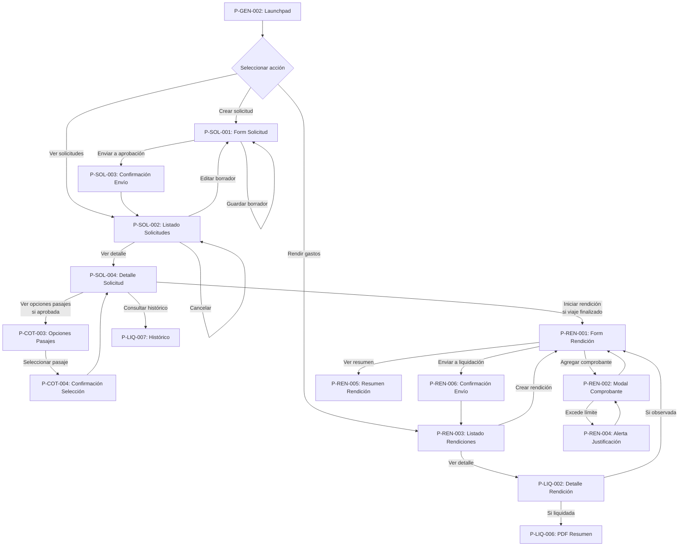
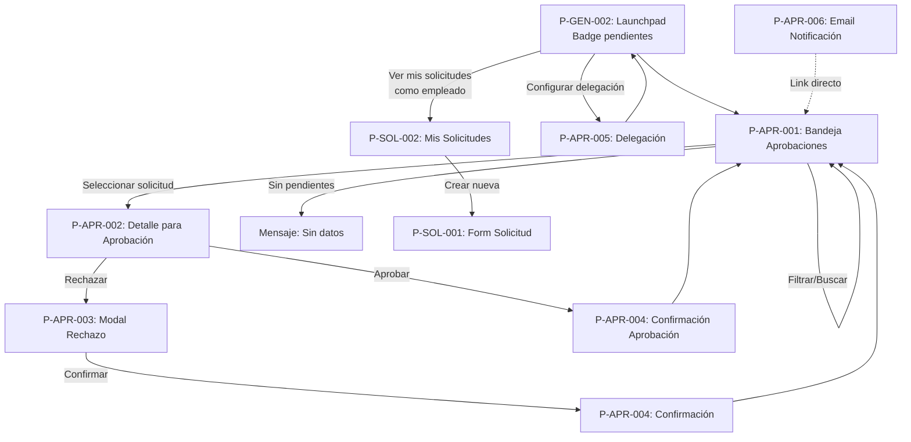
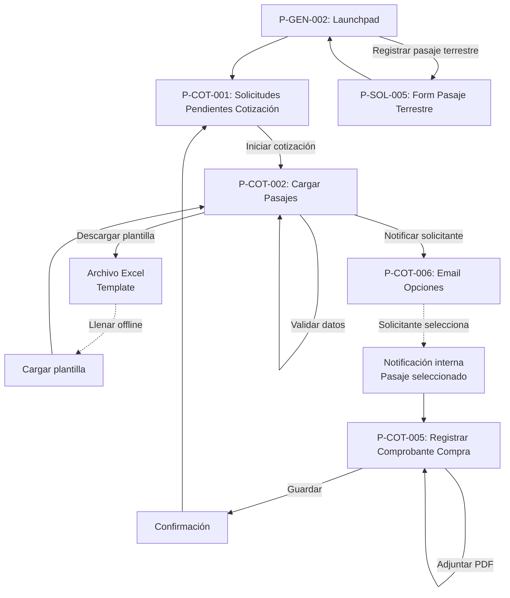
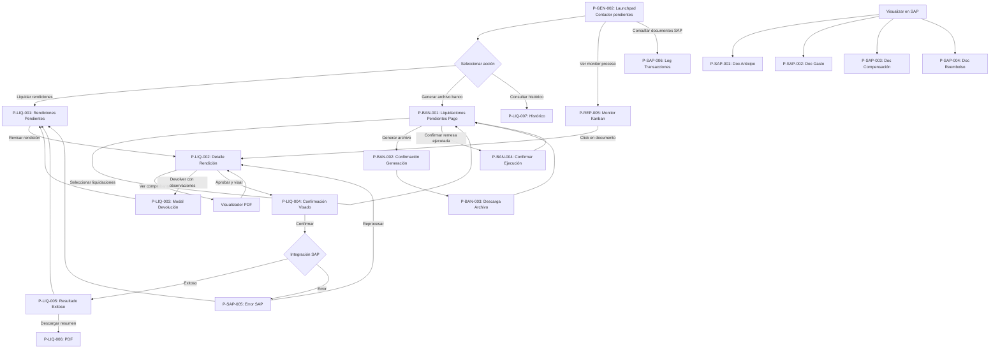
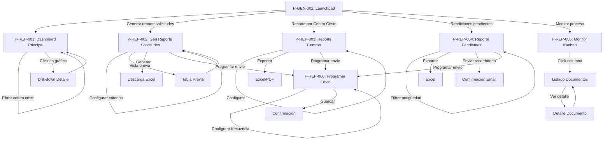
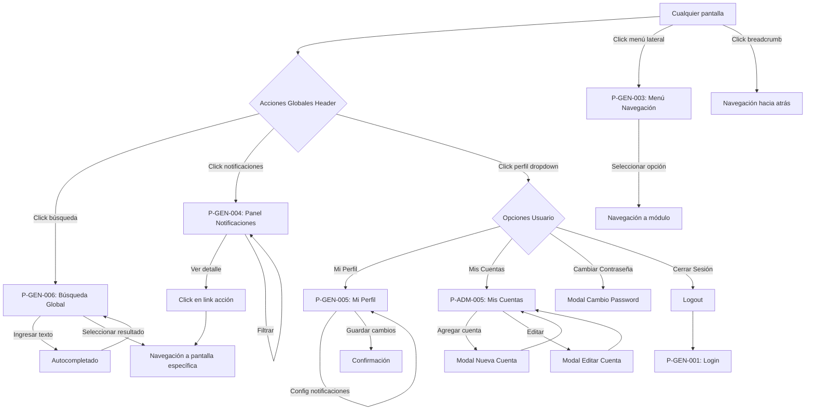
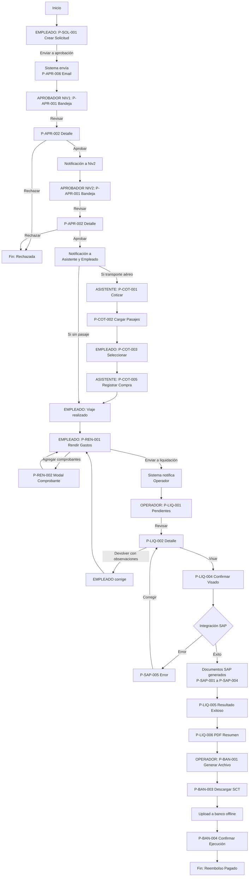

## 11. Diagramas de Navegación

### 11.1. Flujo de Navegación - Empleado/Solicitante

### 11.2. Flujo de Navegación - Aprobador (Nivel 1 y Nivel 2)

### 11.3. Flujo de Navegación - Asistente de Viaje

### 11.4. Flujo de Navegación - Operador de Liquidación

### 11.5. Flujo de Navegación - Administrador del Sistema

```mermaid
graph TD
    A[P-GEN-002: Launchpad] --> B{Panel Administración}
    
    B -->|Gestionar usuarios| C[P-ADM-001: Gestión Usuarios]
    B -->|Flujos aprobación| D[P-ADM-002: Config Flujos]
    B -->|Catálogos maestros| E[P-ADM-003: Maestros]
    B -->|Parámetros sistema| F[P-ADM-004: Parámetros]
    B -->|Cuentas bancarias| G[P-ADM-005: Cuentas Bancarias]
    B -->|Log auditoría| H[P-ADM-006: Log Auditoría]
    B -->|Backup/Restore| I[P-ADM-007: Backup]
    B -->|Plantillas emails| J[P-ADM-008: Plantillas Correos]
    
    C -->|Crear usuario| K[Modal Crear Usuario]
    K -->|Guardar| C
    C -->|Editar| L[Modal Editar Usuario]
    L --> C
    C -->|Activar/Desactivar| C
    C -->|Resetear password| C
    
    D -->|Seleccionar Centro Costo| D
    D -->|Asignar aprobadores| D
    D -->|Configurar tipo aprobación| D
    
    E -->|Tab Monedas| E1[Catálogo Monedas]
    E -->|Tab Tipos Gasto| E2[Catálogo Tipos Gasto]
    E -->|Tab Aerolíneas| E3[Catálogo Aerolíneas]
    E -->|Tab Centros Costo| E4[Catálogo Centros]
    E1 & E2 & E3 & E4 -->|CRUD operations| E
    
    F -->|Editar parámetro| F
    F -->|Guardar cambios| M[Confirmación]
    M --> F
    
    G -->|Buscar empleado| G
    G -->|Agregar cuenta| N[Modal Cuenta]
    N --> G
    
    H -->|Aplicar filtros| H
    H -->|Ver detalle evento| O[Drill-down JSON]
    O --> H
    H -->|Exportar Excel| P[Descarga]
    
    I -->|Generar backup| Q[Proceso Backup]
    Q --> I
    I -->|Restaurar| R[Confirmación Restauración]
    R --> I
    
    J -->|Seleccionar plantilla| J
    J -->|Editar HTML| J
    J -->|Vista previa| J
    J -->|Enviar prueba| S[Modal Email Prueba]
    J -->|Guardar| T[Confirmación]
```

### 11.6. Flujo de Navegación - Reportes (Todos los Roles)

### 11.7. Flujo de Navegación Global - Búsqueda y Notificaciones

### 11.8. Flujo Completo End-to-End - Ciclo de Vida de una Solicitud

### 11.9. Navegación por Módulos - Estructura Jerárquica

```mermaid
graph TD
    Root[P-GEN-002: Launchpad Principal] --> Mod1[Módulo Solicitudes]
    Root --> Mod2[Módulo Rendiciones]
    Root --> Mod3[Módulo Aprobaciones]
    Root --> Mod4[Módulo Cotizaciones]
    Root --> Mod5[Módulo Liquidación]
    Root --> Mod6[Módulo Reportes]
    Root --> Mod7[Módulo Administración]
    
    Mod1 --> M1P1[P-SOL-001: Crear/Editar]
    Mod1 --> M1P2[P-SOL-002: Listado]
    Mod1 --> M1P3[P-SOL-004: Detalle]
    Mod1 --> M1P4[P-SOL-005: Pasaje Terrestre]
    
    Mod2 --> M2P1[P-REN-003: Listado]
    Mod2 --> M2P2[P-REN-001: Crear/Editar]
    Mod2 --> M2P3[P-LIQ-007: Histórico]
    
    Mod3 --> M3P1[P-APR-001: Bandeja]
    Mod3 --> M3P2[P-APR-005: Delegaciones]
    
    Mod4 --> M4P1[P-COT-001: Pendientes]
    Mod4 --> M4P2[P-COT-002: Cargar Pasajes]
    
    Mod5 --> M5P1[P-LIQ-001: Pendientes Liquid]
    Mod5 --> M5P2[P-BAN-001: Gen Archivo Bancario]
    Mod5 --> M5P3[P-BAN-005: Historial Archivos]
    
    Mod6 --> M6P1[P-REP-001: Dashboard]
    Mod6 --> M6P2[P-REP-002: Rep Solicitudes]
    Mod6 --> M6P3[P-REP-003: Rep Centros Costo]
    Mod6 --> M6P4[P-REP-004: Rep Pendientes]
    Mod6 --> M6P5[P-REP-005: Monitor Proceso]
    
    Mod7 --> M7P1[P-ADM-001: Usuarios]
    Mod7 --> M7P2[P-ADM-002: Flujos Aprob]
    Mod7 --> M7P3[P-ADM-003: Maestros]
    Mod7 --> M7P4[P-ADM-004: Parámetros]
    Mod7 --> M7P5[P-ADM-005: Ctas Bancarias]
    Mod7 --> M7P6[P-ADM-006: Log Auditoría]
    Mod7 --> M7P7[P-ADM-007: Backup]
    Mod7 --> M7P8[P-ADM-008: Plantillas Email]
    
    style Root fill:#2E86AB
    style Mod1 fill:#A23B72
    style Mod2 fill:#F18F01
    style Mod3 fill:#C73E1D
    style Mod4 fill:#6A994E
    style Mod5 fill:#BC4B51
    style Mod6 fill:#8B8C89
    style Mod7 fill:#3D5A80
```

